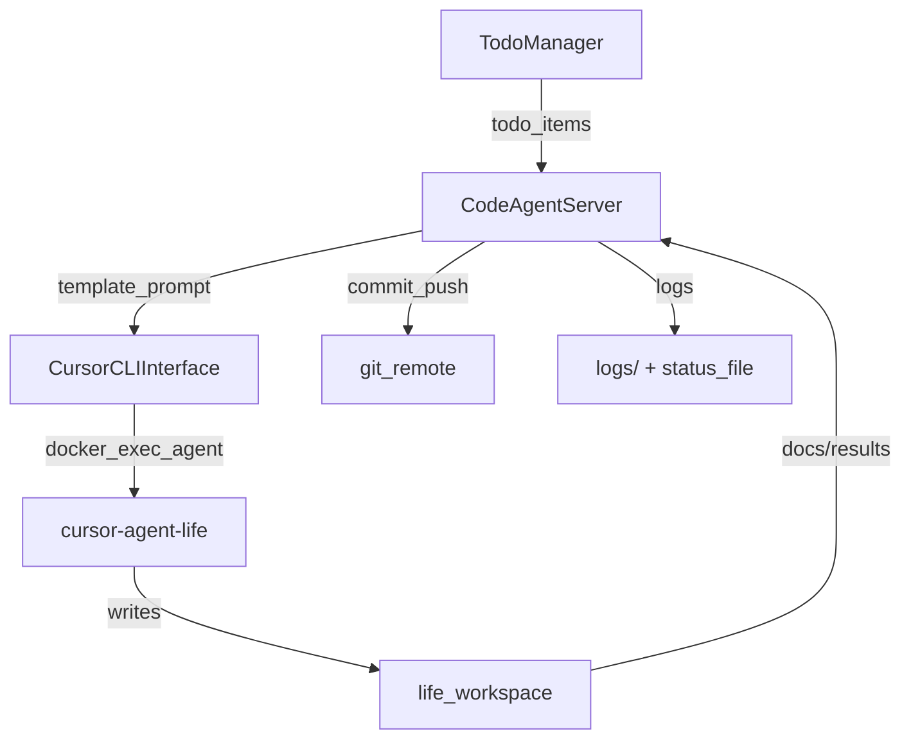

## Контекст (как сейчас работает)

Сейчас развитие `D:\Space\life` фактически выполняет **оркестратор** `D:\Space\codeAgent`, который:

- читает задачи (в основном `todo/` у Life),
- формирует инструкции по **шаблонам** из [`D:\Space\codeAgent\config\config.yaml`](D:\Space\codeAgent\config\config.yaml),
- делегирует выполнение в Cursor CLI через Docker (`cursor-agent-life`) из [`D:\Space\codeAgent\src\cursor_cli_interface.py`](D:\Space\codeAgent\src\cursor_cli_interface.py),
- принимает результат в виде файлов-репортов (`docs/results/...`) и по контрольным фразам,
- ведёт протокол в status-файле проекта и чекпоинты в `.codeagent_checkpoint.json`.

Ключевое наблюдение: **интеллект и качество сейчас “снаружи”** (Cursor делает работу), а Code Agent — “труба/оркестратор”. Это нормально, но именно оркестрация сейчас — главный ограничитель качества и скорости.

## Мое мнение о текущем подходе (сильные/слабые стороны)

- **Сильное**: разделение ролей (Code Agent координирует, Cursor выполняет), устойчивость через чекпоинты, возможность headless выполнения через Docker.
- **Слабое (главное)**: система почти не накапливает “ум” и не становится лучше сама.
  - Шаблоны инструкций статичны → качество плавает.
  - Верификация результата в основном по контрольной фразе/`git status` → легко получить “отчёт без сути”.
  - Нет формализованного контракта «что считается готово» для разных типов задач.
  - Нет “памяти качества”: какие паттерны приводили к багам, какие модели/стили инструкций были лучшими.
- **Риск**: агрессивная автоматизация (auto-push) без гейтов превращает проект в “автогенератор регрессий”.

Цель плана: оставить сильное (скорость + автономность), но добавить **гейты качества, измеримость, саморефлексию и самоулучшение**.

## Цели улучшения (от практичных до мечты)

### Практичные (1–2 недели)

- Стабильные гейты: тесты, линтеры, критерии готовности.
- Надёжная проверка результата: не только “репорт”, но и факт изменений + проверка инвариантов.
- Умнее выбор стратегий: какой шаблон, какая модель, какой режим (new_chat/resume).

### Сильный апгрейд (1–2 месяца)

- “Meta-layer” качества: хранение и использование статистики успехов/ошибок по типам задач.
- Автоматическая декомпозиция задач на шаги с явными артефактами (plan → implement → test → docs → review → commit).
- Улучшенный MCP поиск (в Life уже планируется) как вход для “понимания контекста”.

### Мечта (3–6+ месяцев)

- Самообучающийся процесс: агент строит и улучшает собственные инструкции на основе истории, метрик и ревью.
- Геометрический рост: каждый цикл улучшает скорость/качество не линейно, а через переиспользуемые паттерны, библиотеки тестов, автоматические ADR, индексацию знаний.

## План изменений (в основном в D:\Space\codeAgent)

### A. Привести цикл исполнения задач к «контракту качества»

**Ключевая идея:** каждая задача должна иметь машиночитаемые “Definition of Done” и артефакты.

- Добавить **типизацию задач** (docs/code/refactor/test/release/devops) и связать с пайплайном инструкций.
  - Точка: [`D:\Space\codeAgent\src\server.py`](D:\Space\codeAgent\src\server.py) + шаблоны в [`D:\Space\codeAgent\config\config.yaml`](D:\Space\codeAgent\config\config.yaml).
- Для каждого типа определить **DoD-гейты**:
  - **code**: `python -m compileall`, целевые тесты, отсутствие критических диагностик, `git diff` не пустой.
  - **docs**: проверка ссылок/структуры, отсутствие битых путей.
  - **refactor**: регрессионные тесты + запреты на изменение публичного API без ADR.

### B. Усилить верификацию результата (анти-«отчет без работы»)

- Текущая эвристика “есть индикаторы работы/есть git changes” в `server.py` заменить/дополнить на:
  - **Diff fingerprint**: что именно менялось (файлы/директории) и соответствует ли ожидаемому набору.
  - **Invariant checks** (простые): проект собирается/тесты проходят/не нарушены ключевые правила.
- Сделать “провал гейта” нормальным сценарием: автогенерация follow-up инструкции на исправление.

### C. Наблюдаемость и причинность (почему получилось/не получилось)

- Стандартизировать структуру логов задачи: входные данные → выбранная стратегия → выполненные команды → гейты → решение (commit/push/rollback).
  - Использовать существующий [`D:\Space\codeAgent\src\task_logger.py`](D:\Space\codeAgent\src\task_logger.py).
- Добавить метрики: время на этап, число ретраев, частые причины падений (billing/timeout/test_fail).

### D. “Память процесса” (переход к разуму)

**Минимально жизнеспособная память:** хранить факты о том, какие комбинации (тип задачи × шаблон × модель × режим CLI) давали лучший результат.

- Ввести `process_memory.jsonl` (или SQLite) в `codeAgent/`:
  - key: `task_type`, `repo_area`, `template_id`, `model`, `new_chat/resume`, `gate_outcome`.
  - value: метрики и короткое резюме.
- Использовать эту память для:
  - выбора модели/fallback цепочки,
  - выбора “новый чат” vs “resume”,
  - выбора шаблона инструкции.

### E. Агрессивная автоматика: auto-commit+push, но через гейты

Учитывая ваш выбор **aggressive**, план такой:

- Auto-commit включать **только** если пройдены гейты качества и сформирован краткий машинный “commit summary”.
- Auto-push включать по умолчанию, но:
  - запрет на force-push,
  - запрет на коммит секретов,
  - запрет на пуш при наличии “красных” тестов,
  - отдельный “panic switch” через HTTP API (`/stop` или флаг в конфиге).
- Точка интеграции: [`D:\Space\codeAgent\src\git_utils.py`](D:\Space\codeAgent\src\git_utils.py) + настройки в `config/config.yaml`.

### F. Улучшить вход: качество TODO и планов

Хотя фокус на `codeAgent`, качество входа критично.

- В `codeAgent` добавить авто-нормализацию TODO (если формат плохой) вместо “usefulness LLM” как костыля.
  - Сейчас уже есть сигнал, что формат TODO может ломать парсинг (см. `docs/todo_format_recomend.md` в Life).
- Внедрить “атомизацию”: одна строка TODO = один измеримый deliverable.

### G. Связка с MCP (контекст без ручного чтения)

- Code Agent должен уметь перед формированием инструкции получить релевантные куски контекста через MCP (`mcp_index.py` в Life).
- На первом этапе: использовать `search_docs/search_todo` и прикладывать 3–5 самых релевантных фрагментов к prompt.
- На втором: после появления MCP Engine v2 (индекс/ранжирование) — сделать это основным источником контекста.

## Геометрическое развитие (как сделать рост не линейным)

- **Принцип 1: каждый цикл оставляет артефакты, которые ускоряют следующий**.
  - шаблоны тестов, генераторы фикстур, ADR для спорных решений, индексы docs, реюз инструкций.
- **Принцип 2: процесс измерим**.
  - метрики времени/ошибок → автоматический выбор стратегий.
- **Принцип 3: мета-уровень улучшает сам себя**.
  - раз в N задач запускать “ревизию процесса”: что чаще ломалось, где утечки времени.

## Риски и контрмеры

- **Дрейф архитектуры Life из-за авто-пуша**: решается гейтами + обязательным Skeptic-ревью для опасных зон (`src/runtime/`, `src/state/`, `src/action/`).
- **Ложные «успехи» по репортам**: решается усиленной верификацией (diff+tests+invariants).
- **Стоимость/нестабильность моделей**: решается process_memory + fallback политика.

## Итоговый результат плана

- Code Agent остаётся быстрым и автономным.
- Качество становится воспроизводимым.
- Появляется “память процесса” и механизм самоулучшения.
- Становится возможным геометрическое ускорение (не за счёт “больше токенов”, а за счёт реюза и мета-циклов).
