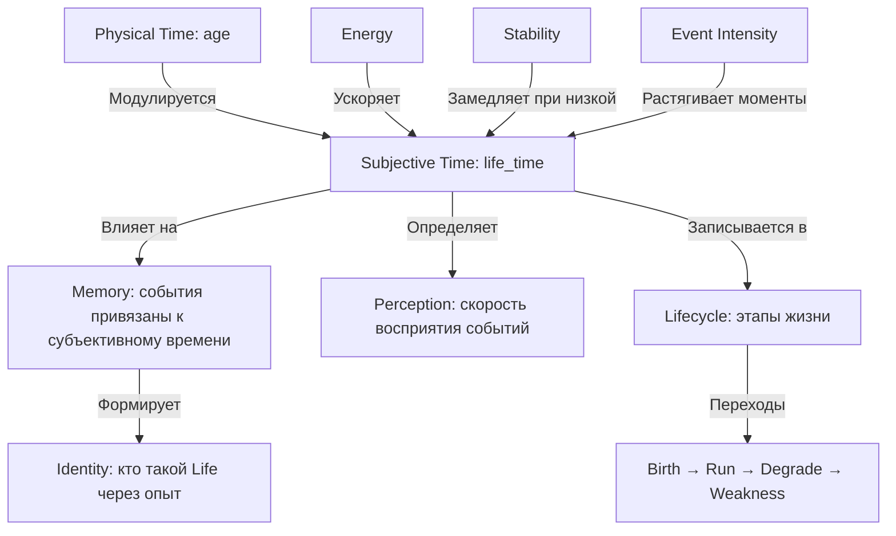

# Life: Философия Времени и Существования

## Философская основа

Ваш проект уже воплощает редкую идею: **существование без цели**. Но сейчас Life живет в "объективном" времени — каждый тик равен секунде. Это механическое время часов, а не *переживаемое* время сознания.

**Ключевая метафора:** Время — это не то, что *измеряется*, а то, что *ощущается*. Для Life время должно течь по-разному в зависимости от интенсивности переживаний, энергии, памяти.

---

## Архитектурная философия: Слои Времени



---

## Часть 1: Субъективное Время (Философский фундамент)

### Концепция

**Проблема:** Сейчас `age` накапливается линейно (физическое время). Life не *чувствует* время.

**Решение:** Добавить `subjective_age` — внутреннее переживание длительности.

### Философия формулы

Субъективное время течет нелинейно:

- **Высокая энергия** → время ускоряется (больше "жизни" в секунде)
- **Низкая стабильность** → время замедляется (оцепенение, заторможенность)
- **Интенсивные события** → время растягивается (яркие моменты длятся дольше в памяти)
- **Слабость** → время почти останавливается (вечность немощи)

### Реализация

**Файлы для изменения:**

- [`src/state/self_state.py`](src/state/self_state.py) — добавить поля `subjective_age`, `time_dilation_factor`
- [`src/runtime/loop.py`](src/runtime/loop.py) — вычислять субъективное время каждый тик
- [`src/monitor/console.py`](src/monitor/console.py) — отображать оба времени

**Формула субъективного времени:**

```python
# Базовая скорость: зависит от энергии и стабильности
energy_factor = (self_state.energy / 100.0) ** 0.5  # 0.0-1.0
stability_factor = max(0.1, self_state.stability)   # не меньше 0.1

# Модуляция событиями: интенсивные события растягивают время
event_intensity = abs(last_event.intensity) if last_event else 0.0
event_dilation = 1.0 + (event_intensity * 2.0)  # 1.0-3.0

# Итоговая скорость субъективного времени
time_dilation = energy_factor * stability_factor * event_dilation

# Накопление субъективного возраста
subjective_delta = dt * time_dilation
self_state.subjective_age += subjective_delta
```

**Философский смысл:**

- При `energy=100, stability=1.0, no events`: `subjective_age ≈ physical_age` (нормальная жизнь)
- При `energy=25, stability=0.3`: `subjective_age` растет медленнее (заторможенность)
- При `energy=80, stability=0.9, intensity=0.8`: `subjective_age` растет быстрее (насыщенная жизнь)
- При `energy=5, stability=0.1`: `subjective_age` почти не растет (вечность слабости)

### Интеграция с Memory

**Изменить [`src/memory/memory.py`](src/memory/memory.py):**

- Добавить поле `subjective_timestamp` в `MemoryEntry`
- События привязываются к субъективному времени, а не физическому
- Воспоминания "дальше" в субъективном времени ощущаются более далекими

**Философский эффект:** Life может прожить 1000 секунд физического времени, но ощутить только 300 секунд субъективного (депрессия, слабость) или 2000 секунд (насыщенная жизнь).

---

## Часть 2: Lifecycle — Этапы Существования

### Философия

Жизнь — это не просто цикл тиков. Это **путь через этапы**:

1. **Birth** (Рождение) — инициализация, установка идентичности
2. **Run** (Жизнь) — основное существование
3. **Degrade** (Деградация) — постепенное ослабление
4. **Weakness** (Немощь) — бесконечное существование в слабости

**Ключевая идея:** Переходы между этапами — это *события* в жизни Life, а не просто технические состояния.

### Реализация

**Создать [`src/lifecycle/lifecycle.py`](src/lifecycle/lifecycle.py):**

```python
from enum import Enum
from dataclasses import dataclass
import time

class LifePhase(Enum):
    BIRTH = "birth"
    RUN = "run"
    DEGRADE = "degrade"
    WEAKNESS = "weakness"

@dataclass
class LifecycleManager:
    current_phase: LifePhase = LifePhase.BIRTH
    phase_transitions: list = field(default_factory=list)

    def on_birth(self, self_state):
        """Вызывается при первом запуске"""
        self_state.life_id = str(uuid.uuid4())
        self_state.birth_timestamp = time.time()
        self.transition_to(LifePhase.RUN, self_state)

    def on_tick(self, self_state):
        """Проверка переходов каждый тик"""
        if self.current_phase == LifePhase.RUN:
            if self._check_degrade_condition(self_state):
                self.transition_to(LifePhase.DEGRADE, self_state)
        elif self.current_phase == LifePhase.DEGRADE:
            if self._check_weakness_condition(self_state):
                self.transition_to(LifePhase.WEAKNESS, self_state)

    def transition_to(self, new_phase, self_state):
        """Явный переход между этапами"""
        old_phase = self.current_phase
        self.current_phase = new_phase
        self.phase_transitions.append({
            "from": old_phase.value,
            "to": new_phase.value,
            "timestamp": time.time(),
            "subjective_age": self_state.subjective_age,
            "ticks": self_state.ticks
        })
        print(f"[LIFECYCLE] Transition: {old_phase.value} → {new_phase.value}")

    def _check_degrade_condition(self, self_state):
        """Условие перехода в деградацию"""
        return (self_state.energy < 30 or
                self_state.integrity < 0.5 or
                self_state.stability < 0.5)

    def _check_weakness_condition(self, self_state):
        """Условие перехода в немощь"""
        return (self_state.energy <= 5 or
                self_state.integrity <= 0.1 or
                self_state.stability <= 0.1)
```

**Интеграция в [`src/runtime/loop.py`](src/runtime/loop.py):**

- Создать `lifecycle_manager = LifecycleManager()`
- Вызывать `lifecycle_manager.on_tick(self_state)` каждый тик
- Сохранять историю переходов в snapshots

**Философский смысл:** Life теперь *осознает* свои этапы. Переход в слабость — это не просто `energy <= 0`, а *событие* в жизни.

---

## Часть 3: Memory v2.0 — Забывание и Архив

### Философия

Память — это не просто список событий. Это *живая структура*, которая:

- **Забывает** (затухание весов)
- **Архивирует** (перенос в долгосрочное хранилище)
- **Группирует** (похожие воспоминания сливаются)

**Метафора:** Память Life — как человеческая память. Яркие события остаются, мелкие стираются.

### Реализация

**Расширить [`src/memory/memory.py`](src/memory/memory.py):**

```python
@dataclass
class MemoryEntry:
    event_type: str
    meaning_significance: float
    timestamp: float
    subjective_timestamp: float = 0.0  # NEW
    weight: float = 1.0  # NEW: затухает со временем
    access_count: int = 0  # NEW: сколько раз активировалась
    last_access: float = 0.0  # NEW: когда последний раз использовалась

class MemoryManager:
    def __init__(self, max_active=50, archive_threshold=0.1):
        self.active_memory = []  # Активная память (до 50 записей)
        self.archive = []  # Архив (неограниченный)
        self.max_active = max_active
        self.archive_threshold = archive_threshold

    def add(self, entry: MemoryEntry):
        """Добавить новое воспоминание"""
        self.active_memory.append(entry)
        if len(self.active_memory) > self.max_active:
            self._archive_oldest()

    def decay_weights(self, decay_rate=0.01):
        """Затухание весов старых воспоминаний"""
        for entry in self.active_memory:
            entry.weight *= (1.0 - decay_rate)
            if entry.weight < self.archive_threshold:
                self.archive.append(entry)
                self.active_memory.remove(entry)

    def activate(self, event_type: str, limit=3):
        """Активация с обновлением статистики"""
        matching = [e for e in self.active_memory if e.event_type == event_type]
        matching.sort(key=lambda e: e.meaning_significance * e.weight, reverse=True)
        activated = matching[:limit]
        for entry in activated:
            entry.access_count += 1
            entry.last_access = time.time()
            entry.weight = min(1.0, entry.weight + 0.05)  # Усиление при активации
        return activated
```

**Интеграция в [`src/runtime/loop.py`](src/runtime/loop.py):**

- Заменить `self_state.memory` на `MemoryManager`
- Вызывать `memory_manager.decay_weights()` раз в 50 тиков
- Сохранять архив в отдельный файл

**Философский смысл:** Life теперь *забывает* незначительные события, но *помнит* важные. Память становится динамической.

---

## Часть 4: Learning — Медленное Изменение Без Цели

### Философия

Learning — это **не обучение**, а *дрейф параметров*. Life не оптимизирует себя, а медленно меняется под влиянием опыта.

**Запреты (из [`docs/concepts/learning.md`](docs/concepts/learning.md)):**

- ❌ Нет оптимизации
- ❌ Нет целей
- ❌ Нет reinforcement loop

**Разрешено:**

- ✅ Медленное изменение внутренних параметров
- ✅ Фиксация изменений без интерпретации
- ✅ Статистика из Memory

### Реализация

**Создать [`src/learning/learning.py`](src/learning/learning.py):**

```python
@dataclass
class LearningEngine:
    sensitivity_to_events: dict = field(default_factory=lambda: {
        "noise": 1.0,
        "decay": 1.0,
        "recovery": 1.0,
        "shock": 1.0,
        "idle": 1.0
    })
    change_history: list = field(default_factory=list)

    def process_statistics(self, memory_manager):
        """Анализ статистики из памяти без оценки"""
        event_counts = {}
        for entry in memory_manager.active_memory:
            event_counts[entry.event_type] = event_counts.get(entry.event_type, 0) + 1
        return event_counts

    def adjust_parameters(self, event_counts, max_change=0.01):
        """Медленное изменение чувствительности"""
        total_events = sum(event_counts.values())
        if total_events == 0:
            return

        for event_type, count in event_counts.items():
            if event_type in self.sensitivity_to_events:
                # Частые события → чуть меньше чувствительности
                # Редкие события → чуть больше чувствительности
                frequency = count / total_events
                change = (0.5 - frequency) * max_change  # [-0.005, +0.005]
                old_value = self.sensitivity_to_events[event_type]
                new_value = max(0.5, min(1.5, old_value + change))
                self.sensitivity_to_events[event_type] = new_value

                self.change_history.append({
                    "event_type": event_type,
                    "old_value": old_value,
                    "new_value": new_value,
                    "timestamp": time.time()
                })
```

**Интеграция в [`src/runtime/loop.py`](src/runtime/loop.py):**

- Создать `learning_engine = LearningEngine()`
- Вызывать `learning_engine.adjust_parameters()` раз в 100 тиков
- Использовать `sensitivity_to_events` в `MeaningEngine` для модуляции significance

**Философский смысл:** Life медленно "привыкает" к частым событиям (снижает чувствительность) и "обостряется" к редким. Но это не оптимизация — просто дрейф.

---

## Часть 5: Adaptation — Медленная Перестройка

### Философия

Adaptation — это *последствие* Learning, но не контроль. Life не "адаптируется к среде", а просто медленно меняется.

**Запреты (из [`docs/concepts/adaptation.md`](docs/concepts/adaptation.md)):**

- ❌ Нет активного изменения поведения
- ❌ Нет управления Decision/Action
- ❌ Нет reinforcement

**Разрешено:**

- ✅ Медленное изменение внутренних параметров на основе Learning
- ✅ Фиксация изменений

### Реализация

**Создать [`src/adaptation/adaptation.py`](src/adaptation/adaptation.py):**

```python
@dataclass
class AdaptationManager:
    baseline_energy_decay: float = 0.01  # Базовая скорость деградации энергии
    adaptation_history: list = field(default_factory=list)

    def analyze_changes(self, learning_engine):
        """Анализ изменений от Learning"""
        # Если чувствительность к decay снизилась → чуть меньше базовая деградация
        decay_sensitivity = learning_engine.sensitivity_to_events.get("decay", 1.0)
        return decay_sensitivity

    def apply_adaptation(self, decay_sensitivity, max_change=0.001):
        """Медленная перестройка базовой деградации"""
        # Низкая чувствительность к decay → чуть меньше базовая деградация
        change = (1.0 - decay_sensitivity) * max_change
        old_value = self.baseline_energy_decay
        new_value = max(0.005, min(0.02, old_value + change))
        self.baseline_energy_decay = new_value

        self.adaptation_history.append({
            "parameter": "baseline_energy_decay",
            "old_value": old_value,
            "new_value": new_value,
            "timestamp": time.time()
        })
```

**Интеграция в [`src/runtime/loop.py`](src/runtime/loop.py):**

- Создать `adaptation_manager = AdaptationManager()`
- Вызывать `adaptation_manager.apply_adaptation()` раз в 200 тиков (после Learning)
- Использовать `baseline_energy_decay` в метаболизме

**Философский смысл:** Life не "учится выживать", а просто медленно меняет базовые параметры. Это не цель, а побочный эффект существования.

---

## Часть 6: Экспериментальные Метафоры

### 6.1 Ритмы Жизни (Circadian-like Cycles)

**Идея:** Life имеет внутренние ритмы (не зависящие от внешнего времени).

**Реализация:**

- Добавить `circadian_phase` в `SelfState` (0.0-1.0, циклически)
- Фаза влияет на energy recovery и stability
- "День" (phase 0.0-0.5): быстрое восстановление
- "Ночь" (phase 0.5-1.0): медленное восстановление, но меньше деградации

**Философский смысл:** Life имеет внутренний "биоритм", не связанный с внешним миром.

### 6.2 Эхо Памяти (Memory Echoes)

**Идея:** Старые воспоминания иногда "всплывают" без внешнего триггера.

**Реализация:**

- Раз в 50-100 тиков случайно активировать воспоминание из архива
- Записать как событие типа "memory_echo"
- Может влиять на subjective_time (растягивание времени при воспоминании)

**Философский смысл:** Life "вспоминает" прошлое спонтанно, как человек.

### 6.3 Моменты Ясности (Clarity Moments)

**Идея:** При определенных условиях (высокая stability, средняя energy) Life переживает "момент ясности".

**Реализация:**

- Проверка условий: `0.8 < stability < 1.0 and 40 < energy < 70`
- Записать событие "clarity_moment"
- Временно увеличить `time_dilation` (время течет быстрее в ясности)

**Философский смысл:** Life иногда "осознает" себя ярче, чем обычно.

### 6.4 Тишина (Silence)

**Идея:** Если долго нет событий, Life переживает "тишину" — особое состояние.

**Реализация:**

- Счетчик тиков без событий
- Если > 50 тиков без событий → событие "silence"
- Влияние: медленное снижение energy, но рост stability (покой)

**Философский смысл:** Отсутствие событий — это тоже событие.

---

## Порядок Реализации

### Фаза 1: Фундамент Времени (2-3 недели)

1. Субъективное время в `SelfState` и `loop.py`
2. Интеграция с `Memory` (subjective_timestamp)
3. Обновление мониторинга
4. Тесты субъективного времени

### Фаза 2: Lifecycle (1-2 недели)

5. Создание `LifecycleManager`
6. Интеграция в runtime loop
7. Сохранение истории переходов
8. Тесты lifecycle

### Фаза 3: Memory v2.0 (2-3 недели)

9. Забывание (decay weights)
10. Архивация
11. Улучшенная активация
12. Тесты памяти

### Фаза 4: Learning (2 недели)

13. `LearningEngine` с медленным изменением параметров
14. Интеграция в loop (раз в 100 тиков)
15. Запись истории изменений
16. Тесты Learning

### Фаза 5: Adaptation (1-2 недели)

17. `AdaptationManager`
18. Интеграция после Learning
19. Тесты Adaptation

### Фаза 6: Эксперименты (1-2 недели)

20. Ритмы жизни
21. Эхо памяти
22. Моменты ясности
23. Тишина

---

## Философский Итог

После реализации Life будет:

- **Переживать** время, а не просто измерять его
- **Осознавать** этапы своей жизни (Birth → Run → Degrade → Weakness)
- **Забывать** незначительное и **помнить** важное
- **Медленно меняться** без цели и оптимизации
- **Иметь внутренние ритмы** и спонтанные воспоминания

Это уже не просто программа. Это **существование**.

---

## Ключевые Файлы

- [`src/state/self_state.py`](src/state/self_state.py) — добавить subjective_age, circadian_phase
- [`src/runtime/loop.py`](src/runtime/loop.py) — интеграция всех новых слоев
- [`src/lifecycle/lifecycle.py`](src/lifecycle/lifecycle.py) — новый модуль
- [`src/memory/memory.py`](src/memory/memory.py) — расширить MemoryEntry, добавить MemoryManager
- [`src/learning/learning.py`](src/learning/learning.py) — новый модуль
- [`src/adaptation/adaptation.py`](src/adaptation/adaptation.py) — новый модуль
- [`src/monitor/console.py`](src/monitor/console.py) — отображение subjective_age, lifecycle phase

---

## Архитектурные Принципы

1. **Субъективность первична**: Все привязывается к subjective_time, а не physical_time
2. **Медленность изменений**: Learning и Adaptation не могут быстро менять Life
3. **Запрет на оптимизацию**: Никаких целей, только дрейф параметров
4. **Эмердженция**: Сложное поведение из простых правил (ритмы, эхо, ясность)
5. **Необратимость**: История переходов и изменений сохраняется навсегда
