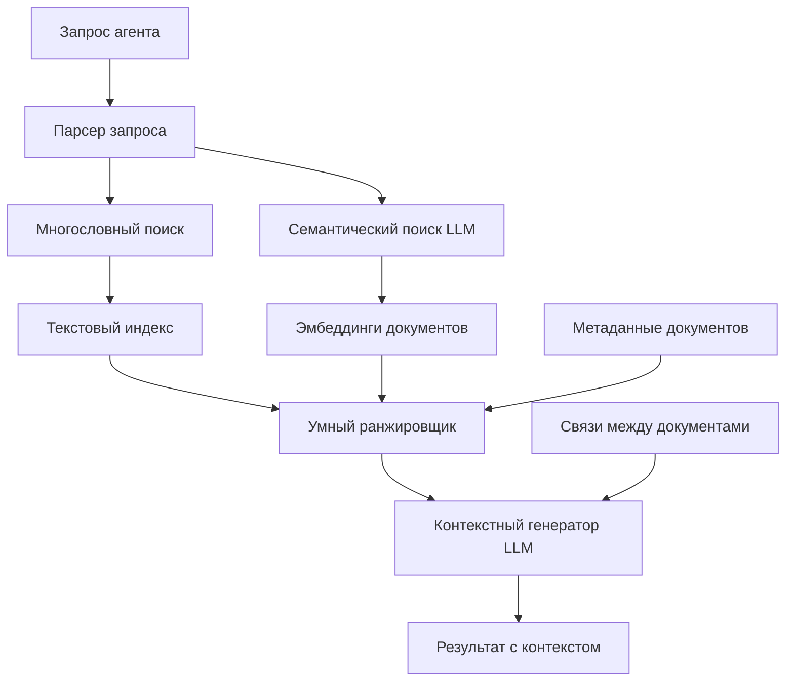

# План переработки MCP движка life-docs

## Цель

Создать интеллектуальный MCP сервер, который помогает агентам максимально точно понимать проект Life через улучшенный поиск, семантическое понимание и контекстуальные связи.

## Архитектура решения

### Компоненты системы



## Этап 1: Многословный поиск (Критично)

### Проблема

Текущий поиск использует точную подстроку - не находит "API server runtime" если слова разделены.

### Решение

Реализовать поиск по списку слов с опциями:

- `AND` режим: все слова должны присутствовать (по умолчанию)
- `OR` режим: любое слово должно присутствовать
- `PHRASE` режим: точная фраза (текущее поведение)

**Файл**: `mcp_index.py`

**Изменения**:

1. Добавить параметр `search_mode: str = "AND"` в `search_docs` и `search_todo`
2. Разбить запрос на слова: `words = query.lower().split()`
3. Проверять каждое слово в документе с учетом режима:

   - `AND`: `all(word in content_lower for word in words)`
   - `OR`: `any(word in content_lower for word in words)`
   - `PHRASE`: `query_lower in content_lower` (текущее)

**Преимущества**:

- Поиск "API server runtime" найдет документы, где есть все три слова
- Поиск "Memory activation" найдет документы с обоими терминами

## Этап 2: Индексация и кеширование

### Проблема

Текущий поиск сканирует все файлы при каждом запросе - медленно для 80+ документов.

### Решение

Добавить предварительную индексацию при старте сервера.

**Новый файл**: `mcp_index_engine.py`

**Компоненты**:

1. **DocumentIndex**: класс для хранения индекса

   - `documents: Dict[str, DocumentInfo]` - метаданные документов
   - `word_index: Dict[str, Set[str]]` - обратный индекс (слово -> документы)
   - `content_cache: Dict[str, str]` - кеш содержимого

2. **DocumentInfo**: dataclass с метаданными

   - `path: str`
   - `category: str` (core/system/concepts/meta/test/archive)
   - `status: str` (implemented/minimal_form_defined/conceptual/locked/archive)
   - `title: str`
   - `word_count: int`
   - `last_modified: float`

**Методы**:

- `build_index()` - построение индекса при старте
- `search_multiword(query, mode="AND")` - быстрый поиск по индексу
- `get_relevance_score(doc_path, words)` - подсчет релевантности

## Этап 3: Умное ранжирование

### Проблема

Текущий поиск не учитывает важность документов по структуре и статусу.

### Решение

Реализовать релевантность с весами:

**Приоритеты документов**:

- `core/` → вес 1.0 (самые важные)
- `system/` → вес 0.9 (реализованные системы)
- `concepts/` → вес 0.7 (концепции)
- `meta/` → вес 0.6 (инструкции)
- `test/` → вес 0.5 (тестирование)
- `archive/` → вес 0.3 (архив)

**Статусы**:

- `implemented` → +0.2
- `minimal_form_defined` → +0.1
- `locked` → +0.15
- `archive` → -0.2

**Формула релевантности**:

```
score = base_weight * (category_weight + status_bonus) * word_match_score
```

Где `word_match_score` = количество совпадений слов / общее количество слов в запросе

**Результаты сортируются по убыванию score**

## Этап 4: Семантический поиск через LLM

### Цель

Понимать намерения агента даже при несовпадении терминов.

### Решение

Использовать бесплатные LLM API для:

1. **Генерация эмбеддингов** запросов (опционально, если API поддерживает)
2. **Переформулировка запроса** - расширение с синонимами и связанными терминами
3. **Генерация контекста** - улучшение извлеченного контекста для агентов

**Новый файл**: `mcp_llm_helper.py`

**Компоненты**:

1. **LLMClient**: базовый класс для работы с LLM API

   - Метод `expand_query(query)` - расширение запроса синонимами
   - Метод `improve_context(query, context)` - улучшение контекста ответа

2. **Бесплатные провайдеры** (выбрать по доступности):

   - Hugging Face Inference API
   - Together AI (бесплатный tier)
   - Groq API (быстрый, бесплатный tier)
   - Local LLM через Ollama (если доступен)

**Интеграция**:

- Перед поиском: `expanded_query = llm.expand_query(query)` → дополнительные ключевые слова
- После извлечения контекста: `improved_context = llm.improve_context(query, context)` → лучший контекст

**Fallback**: Если LLM недоступен, используется обычный поиск.

## Этап 5: Контекстуальные связи

### Цель

Находить связанные документы для полного понимания контекста.

### Решение

Извлекать ссылки из Markdown и строить граф связей.

**Компоненты**:

1. **LinkExtractor**: парсинг [`текст`](path.md) из документов
2. **DocumentGraph**: граф связей между документами
3. **RelatedDocs**: поиск связанных документов

**Методы**:

- `get_related_docs(doc_path, depth=1)` - связанные документы
- `get_upstream_docs(doc_path)` - документы, на которые ссылается текущий
- `get_downstream_docs(doc_path)` - документы, ссылающиеся на текущий

**Интеграция в поиск**:

После основного поиска предлагать связанные документы.

## Этап 6: Фильтрация по ролям агентов

### Цель

Учитывать роль агента при поиске (Architect, Implementer, Skeptic, Orchestrator).

### Решение

Добавить параметр `agent_role: str = None` в поисковые функции.

**Приоритеты по ролям**:

- **Architect**: `core/`, `concepts/`, `meta/`
- **Implementer**: `system/`, `src/` (если добавим поиск кода)
- **Skeptic**: все документы, но с акцентом на `test/`
- **Orchestrator**: `meta/`, `todo/`

**Реализация**:

```python
if agent_role == "architect":
    category_weights["core"] *= 1.5
    category_weights["concepts"] *= 1.3
```

## Этап 7: Новые инструменты MCP

### Дополнительные инструменты для агентов

1. **`search_by_category(category: str, query: str, limit: int = 10)`**

   - Поиск в определенной категории (core/system/concepts/etc)

2. **`get_related_docs(path: str, depth: int = 1)`**

   - Найти связанные документы

3. **`get_doc_metadata(path: str)`**

   - Метаданные документа (статус, категория, связи)

4. **`search_by_status(status: str, query: str, limit: int = 10)`**

   - Поиск только в документах определенного статуса

5. **`get_doc_summary(path: str)`**

   - Краткое резюме документа (через LLM)

6. **`find_similar_docs(path: str, limit: int = 5)`**

   - Найти похожие документы (по словам и связям)

## Этап 8: Оптимизация контекста

### Улучшение извлечения контекста

**Текущая проблема**: Контекст берется из одной строки (5 строк вокруг).

**Решение**:

1. **Множественные вхождения**: находить все вхождения слов, не только первое
2. **Умный контекст**: извлекать целые абзацы или секции
3. **Резюме секций**: если документ большой, генерировать резюме секций через LLM

**Реализация**:

- Находить все строки с совпадениями
- Группировать близкие вхождения (в пределах N строк)
- Извлекать контекст вокруг каждой группы
- Объединять контексты с указанием "Также упоминается: ..."

## Этап 9: Код как контекст

### Интеграция поиска в исходном коде

**Расширение поиска на `src/`**:

- Добавить `search_code(query: str, limit: int = 10)`
- Индексировать Python файлы
- Связывать код с документацией через комментарии и docstrings

**Связь код-документация**:

- В документации есть ссылки на код: `[src/state/self_state.py]`
- Обратная связь: найти документацию по файлу кода

## Этап 10: Кеширование и производительность

### Оптимизации

1. **Асинхронное чтение файлов**: использовать `asyncio` для параллельного чтения
2. **Ленивая загрузка**: загружать содержимое только при необходимости
3. **TTL кеша**: обновление индекса при изменении файлов (через `mtime`)
4. **Инкрементальная индексация**: обновлять только измененные документы

## План реализации

### Приоритет 1 (Критично для работы)

- Этап 1: Многословный поиск
- Этап 2: Индексация и кеширование
- Этап 3: Умное ранжирование

### Приоритет 2 (Улучшение качества)

- Этап 4: Семантический поиск через LLM
- Этап 5: Контекстуальные связи
- Этап 8: Оптимизация контекста

### Приоритет 3 (Дополнительные возможности)

- Этап 6: Фильтрация по ролям
- Этап 7: Новые инструменты MCP
- Этап 9: Код как контекст
- Этап 10: Кеширование и производительность

## Технические детали

### Новые зависимости

```python
# requirements.txt (добавить)
# Для LLM (выбрать один):
# - together (Together AI)
# - groq (Groq API)
# - huggingface-hub (Hugging Face)
# - ollama (локальный LLM)
```

### Структура файлов

```
mcp_index.py          # Основной MCP сервер (FastMCP)
mcp_index_engine.py   # Движок поиска и индексации
mcp_llm_helper.py     # Интеграция с LLM
mcp_metadata.py       # Извлечение метаданных документов
mcp_links.py          # Граф связей между документами
```

### Обратная совместимость

Все существующие инструменты остаются с теми же сигнатурами. Новые параметры (mode, agent_role) опциональны.

## Метрики успеха

1. **Покрытие запросов**: "API server runtime" находит релевантные документы
2. **Скорость**: поиск в 80+ документах < 100ms (с индексом)
3. **Релевантность**: топ-3 результата содержат нужную информацию в 90%+ случаев
4. **Контекст**: извлеченный контекст достаточен для понимания без чтения полного документа

## Риски и митигация

1. **LLM недоступен**: Fallback на текстовый поиск
2. **Производительность индексации**: Ленивая загрузка, кеширование
3. **Обновление индекса**: Отслеживание изменений файлов через mtime
4. **Сложность реализации**: Поэтапная реализация с тестированием каждого этапа
