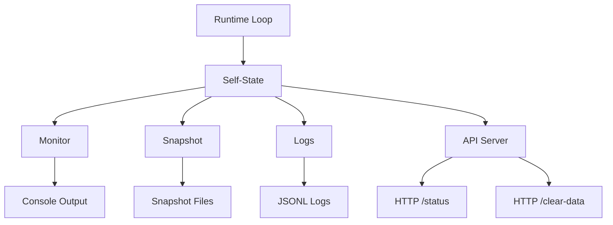

# 01_ARCHITECTURE.md

## Проект: **life**

Этот документ описывает **архитектуру системы**, обеспечивающей непрерывное существование агента во времени.

Архитектура намеренно проста, модульна и наблюдаема. Любой компонент можно заменить, не разрушая целостность жизни процесса.

---

## 1. Архитектурный принцип

> **life — это не модель, а процесс.**
> Модели — лишь инструменты внутри него.

Ключевые свойства архитектуры:

* непрерывный runtime-цикл
* единое долгоживущее состояние
* необратимость изменений
* отсутствие «главного интеллекта»

---

## 2. Высокоуровневая схема

```
┌────────────────────┐
│   Runtime Loop     │  ← ядро жизни
└─────────┬──────────┘
          ↓
┌────────────────────┐
│   Self-State       │  ← непрерывное «Я»
└─────────┬──────────┘
          ↓
┌────────────────────┐
│   World Model      │  ← представление среды
└─────────┬──────────┘
          ↓
┌────────────────────┐
│   Policy / Action  │  ← выбор действий
└─────────┬──────────┘
          ↓
┌────────────────────┐
│   Effects / I/O    │  ← наблюдаемые последствия
└─────────┬──────────┘
          ↓
┌────────────────────┐
│   API Server       │  ← интерфейс наблюдения
└────────────────────┘
```

Все блоки существуют **постоянно**, а не по запросу.

### Диаграмма потоков



---

## 3. Runtime Loop (ядро)

Runtime Loop — это **единственный обязательный компонент**.

Его задачи:

* поддерживать течение времени
* вызывать обновление всех модулей
* обеспечивать необратимость

Принципиальные свойства:

* работает всегда
* не зависит от пользователя
* использует tick_interval для интервала тиков
* не знает про LLM

Упрощённо:

```
while alive:
    sense()
    update_world()
    update_self()
    decide()
    act()
    log()
    sleep(tick_interval)
```

---

## 4. Self-State (непрерывное «Я»)

Self-State — это **не память диалога** и не набор переменных.

Содержит:

* текущие внутренние параметры
* долговременные тенденции
* накопленные ограничения
* следы прошлых решений

Ключевые свойства:

* хранится на диске
* обновляется инкрементально
* не может быть полностью сброшен
* изменения необратимы

Реализация:

* append-only журнал событий
* периодические снапшоты
* деградация старых влияний

---

## 5. World Model (мир)

World Model — это **то, как система видит мир**, а не сам мир.

На текущем этапе:

* мир симулируется
* источники событий синтетические
* нет физического тела

В будущем:

* ESP32 и реальные датчики

World Model:

* агрегирует входные сигналы
* фильтрует шум
* сохраняет историю восприятия

---

## 6. Policy / Action

Policy отвечает за **выбор следующего действия**.

Важно:

* действия могут быть минимальными (лог, сигнал, пауза)
* отсутствие действия — тоже действие
* политика может быть детерминированной

На раннем этапе:

* правила
* вероятностные переходы
* простая эвристика

LLM:

* подключается позже
* как советник, а не контроллер

---

## 7. Effects / I/O

Effects — это всё, что делает жизнь наблюдаемой:

* логи
* файлы
* сигналы
* сообщения

Если нет эффектов — нет наблюдаемого существования.

---

## 8. API Server

API Server предоставляет HTTP интерфейс для наблюдения и управления жизнью:

* `/status` — возвращает текущее Self-State в JSON
* `/clear-data` — очищает логи и snapshot-файлы

Сервер работает в отдельном потоке, не прерывая Runtime Loop.

---

## 9. Dev Mode

Dev Mode включает автоматическую перезагрузку модулей при изменении кода:

* отслеживает изменения в исходных файлах
* перезагружает модули importlib.reload
* перезапускает API сервер и Runtime Loop

Позволяет разрабатывать без остановки процесса.

---

## 10. Snapshot

Snapshot — это сохранение полного состояния жизни в файл:

* сохраняется каждые snapshot_period тиков
* файлы именуются snapshot_{tick:06d}.json
* позволяет анализировать историю состояний

---

## 11. Logs

Logs — это append-only журнал событий:

* JSONL формат для каждого тика
* содержит параметры состояния
* используется для анализа и визуализации

---

## 12. Память и необратимость

## 13. Память и необратимость

Архитектура запрещает:

* полный reset состояния
* silent rollback
* скрытое редактирование истории

Допускается:

* деградация
* забывание
* потеря деталей

Но не исчезновение следов.

---

## 14. Распределение по машинам (опционально)

Компоненты могут быть разделены:

* Runtime + Self-State → PC1
* World Model → PC2
* Policy / Effects → PC3

Связь:

* файловая система
* очереди сообщений
* локальная сеть

---

## 15. Архитектурные инварианты

Нельзя нарушать:

1. Runtime Loop всегда жив
2. Self-State не обнуляется
3. Время идёт только вперёд
4. Ошибки имеют последствия
5. Наблюдатель может остановить процесс

Если нарушен хотя бы один пункт — это **уже не life**.

---

## Инструкции по запуску и настройке

### Базовый запуск

```
python src/main_server_api.py
```

### С параметрами

```
python src/main_server_api.py --tick-interval 0.5 --snapshot-period 20 --clear-data yes
```

### Dev mode

```
python src/main_server_api.py --dev
```

### Очистка данных

Через API:

```
curl http://localhost:8000/clear-data
```

Или при запуске:

```
python src/main_server_api.py --clear-data yes
```

### Остановка сервера

Нажать Enter в консоли или отправить SIGTERM.

---

## Рекомендации по очистке данных и остановке

* Очищайте данные перед новым экспериментом: `--clear-data yes`
* В dev mode изменения применяются автоматически
* Snapshot позволяют восстановить состояние, но не перезапускать жизнь
* Останавливайте сервер корректно для сохранения финального состояния
