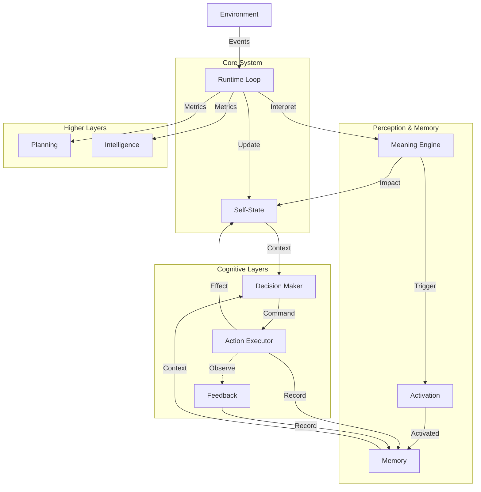

# 01_ARCHITECTURE.md — Архитектура системы

## Обзор

Архитектура Life построена по принципу **слоеного пирога**, где каждый следующий слой опирается на предыдущий, но не управляет им напрямую.

## Слои системы

### 1. Runtime Loop (Сердцебиение)
Центральный цикл, который обеспечивает течение времени.
*   **Роль:** Оркестрация всех процессов.
*   **Документация:** [runtime-loop.md](../components/runtime-loop.md)

### 2. Self-State (Тело)
Хранилище текущего состояния системы.
*   **Роль:** Поддержание гомеостаза, накопление усталости, энергии, возраста.
*   **Документация:** [self-state.md](../components/self-state.md)

### 3. Environment (Среда)
Источник внешних событий и неопределенности.
*   **Роль:** Генерация стимулов (шум, шок, восстановление).
*   **Документация:** [environment.md](../components/environment.md)

### 4. Meaning Engine (Восприятие)
Интерпретатор событий. Переводит объективные факты в субъективный опыт.
*   **Роль:** Оценка значимости событий для конкретного состояния Life.
*   **Документация:** [meaning-engine.md](../components/meaning-engine.md)

### 5. Memory (Память)
Накопление опыта и эпизодических воспоминаний.
*   **Роль:** Хранение событий, состояний и действий для будущего использования.
*   **Документация:** [memory-concept.md](../concepts/memory-concept.md) (концепция), [memory.md](../components/memory.md) (реализация)

### 6. Activation (Активация)
Активация релевантной памяти по типу события.
*   **Роль:** Выбор подходящих воспоминаний для текущего контекста.
*   **Документация:** [activation-concept.md](../concepts/activation-concept.md) (концепция), [activation.md](../components/activation.md) (реализация)

### 7. Decision (Решение)
Выбор паттерна реакции на основе состояния и памяти.
*   **Роль:** Минимальный выбор следующего шага без планирования или оптимизации.
*   **Документация:** [decision-concept.md](../concepts/decision-concept.md) (концепция), [decision.md](../components/decision.md) (реализация)

### 8. Action (Действие)
Выполнение выбранного решения.
*   **Роль:** Атомарное выполнение действий с записью в память.
*   **Документация:** [action-concept.md](../concepts/action-concept.md) (концепция), [action.md](../components/action.md) (реализация)

### 9. Feedback (Обратная связь)
Фиксация последствий действий без оценки.
*   **Роль:** Наблюдение изменений состояния после действий и запись фактов для будущего использования.
*   **Документация:** [feedback-concept.md](../concepts/feedback-concept.md) (концепция), [feedback.md](../components/feedback.md) (реализация)

### 10. Planning (Планирование)
Фиксация потенциальных последовательностей событий.
*   **Роль:** Пассивная запись статистики без оценки или выполнения.
*   **Документация:** [planning.md](../concepts/planning.md)

### 11. Intelligence (Интеллект)
Сбор метрик и информации о системе.
*   **Роль:** Прокси-слой для измерения состояния без интерпретации.
*   **Документация:** [intelligence.md](../concepts/intelligence.md)

### 12. Monitor (Наблюдатель)
Инструмент для внешнего наблюдения за системой.
*   **Роль:** Визуализация состояния без вмешательства.
*   **Документация:** [monitor.md](../components/monitor.md)

### 13. API Server (Интерфейс)
Точка входа для управления и интеграции.
*   **Роль:** Запуск, остановка, подача внешних сигналов.
*   **Документация:** [api-server.md](../components/api-server.md)

## Потоки данных

1.  **Входящий поток:** Environment -> Event Queue -> Runtime Loop -> Meaning Engine -> Activation -> Memory -> Decision -> Action -> Self-State Update.
2.  **Поток памяти:** Events -> Memory (через Activation) -> Decision (как контекст).
3.  **Поток обратной связи:** Action -> Feedback (наблюдение через 3-10 тиков) -> Memory (запись фактов).
4.  **Поток метрик:** Runtime Loop -> Planning / Intelligence (пассивный сбор).
5.  **Поток наблюдения:** Self-State -> Monitor -> Logs / Console.

## Принципы взаимодействия

*   **Асинхронность:** Среда живет своей жизнью, Life — своей.
*   **Изоляция:** Слои знают только о соседях. Decision не знает о деталях реализации Loop.
*   **Необратимость:** Изменения в Self-State нельзя отменить, только компенсировать новыми изменениями.
