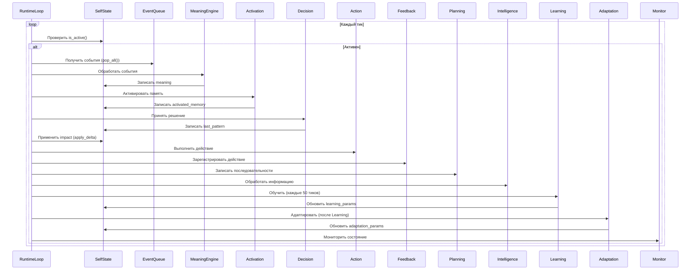
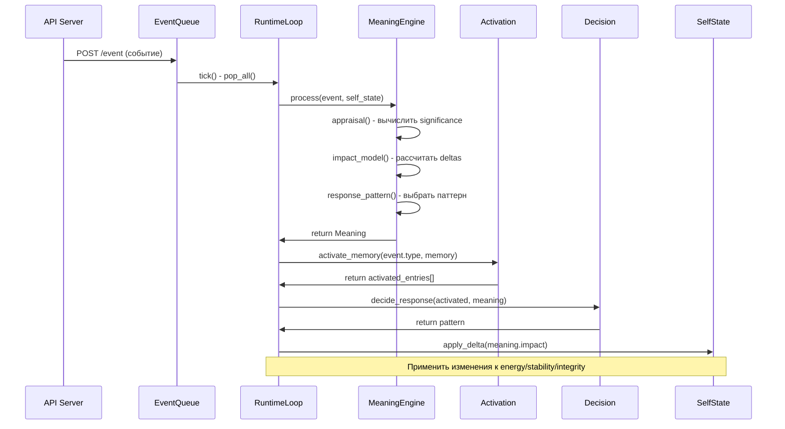
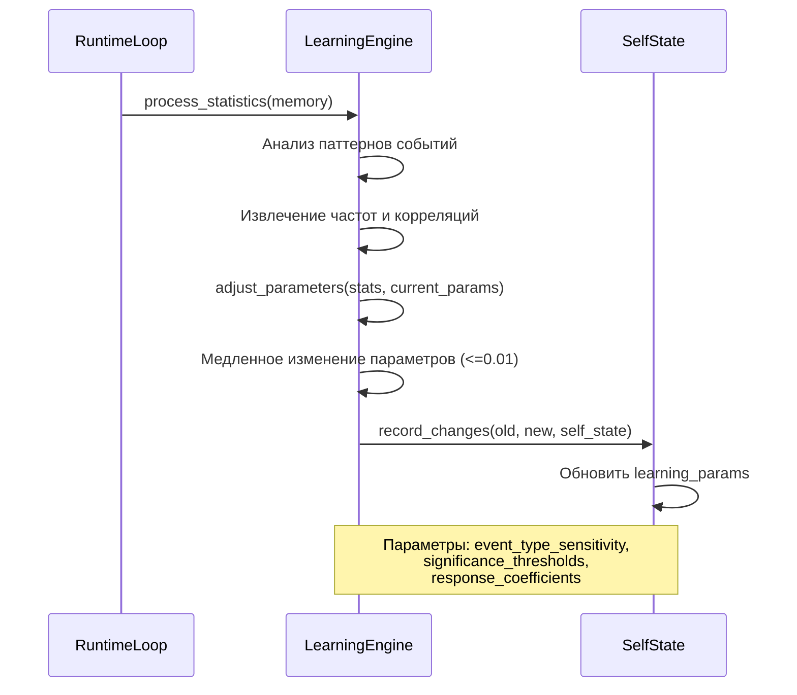
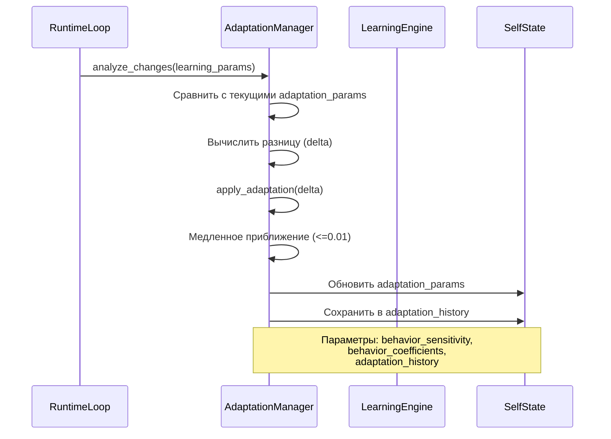
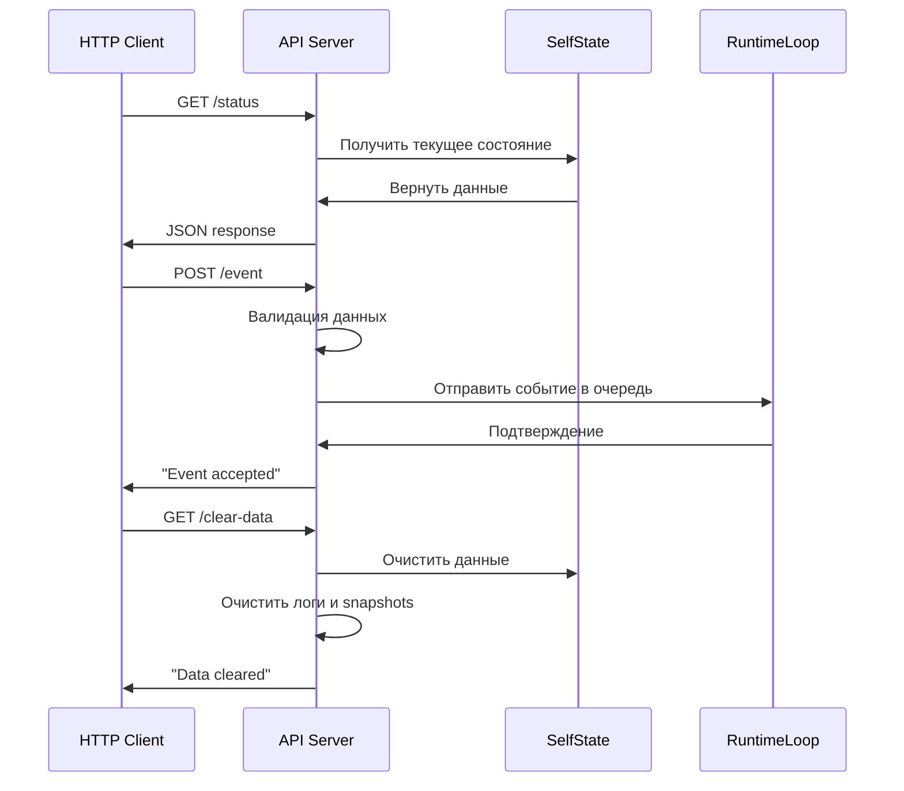
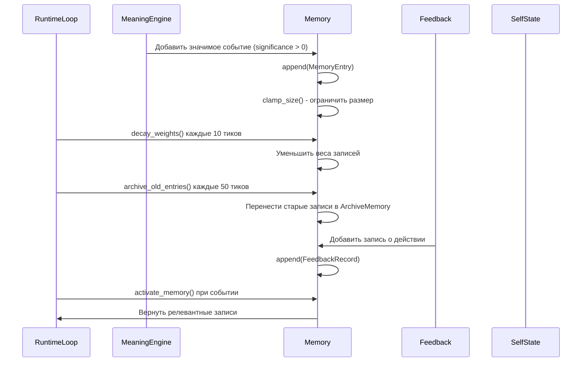

# Диаграммы последовательности основных потоков

> **Назначение:** Визуализация основных потоков данных и взаимодействия компонентов в системе Life

## 1. Runtime Loop - главный цикл жизни

## 2. Event Processing - обработка событий

## 3. Learning Cycle - цикл обучения

## 4. Adaptation Cycle - цикл адаптации

## 5. API Request Flow - обработка API запросов

## 6. Memory Operations - операции с памятью

## Легенда диаграмм

- **RuntimeLoop**: Главный цикл жизни системы
- **SelfState**: Внутреннее состояние системы
- **EventQueue**: Очередь событий из внешней среды
- **MeaningEngine**: Интерпретация значимости событий
- **Activation**: Активация релевантной памяти
- **Decision**: Принятие решений о паттернах реакции
- **Action**: Выполнение внутренних действий
- **Feedback**: Обратная связь и наблюдение последствий
- **Planning**: Фиксация потенциальных последовательностей
- **Intelligence**: Обработка информации
- **Learning**: Медленное обучение на статистике
- **Adaptation**: Медленная адаптация поведения
- **Monitor**: Система наблюдения и логирования

---

*Диаграммы созданы в формате Mermaid для интеграции в документацию.*