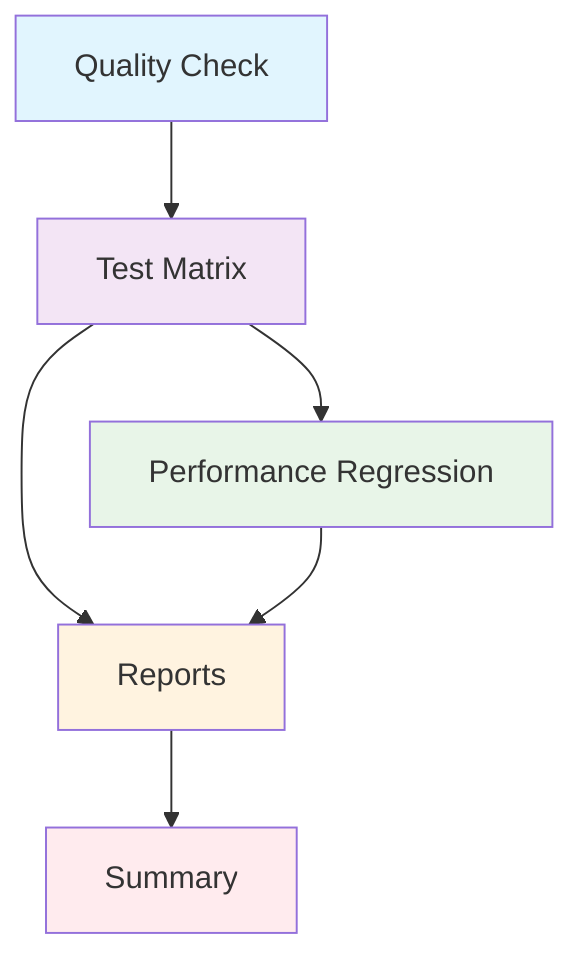

# CI/CD Pipeline Documentation

## Обзор

Проект Life использует комплексный CI/CD pipeline на базе GitHub Actions для автоматического тестирования и контроля качества кода.

## Архитектура Pipeline

### Jobs Overview



### 1. Quality Check (`quality`)
- **Цель:** Проверка качества кода перед запуском тестов
- **Инструменты:** ruff, black, isort, mypy
- **Время выполнения:** ~2-3 минуты
- **Запускается:** Всегда

### 2. Test Matrix (`test-matrix`)
- **Цель:** Параллельное выполнение тестов по категориям
- **Категории:**
  - `unit` - Быстрые unit тесты
  - `static` - Статический анализ структур
  - `smoke` - Базовая функциональность
  - `integration` - Тесты взаимодействия
  - `performance` - Производительность
  - `concurrency` - Многопоточность и race conditions

### 3. Performance Regression (`performance-regression`)
- **Цель:** Проверка регрессий производительности
- **Запускается:** Только для main/develop веток или PR с лейблом `performance-check`

### 4. Reports (`reports`)
- **Цель:** Генерация сводных отчетов и артефактов
- **Артефакты:**
  - HTML отчеты о покрытии
  - XML результаты тестов
  - Сводные отчеты по категориям

## Стратегия тестирования по веткам

### Основные ветки (main, develop)
```yaml
Запускаемые категории: unit, static, smoke, integration, performance, concurrency
Performance regression: ✅ Включена
Время выполнения: ~25-35 минут
```

### Pull Requests (по умолчанию)
```yaml
Запускаемые категории: unit, static, smoke
Performance regression: ❌ Отключена
Время выполнения: ~10-15 минут
```

### Pull Requests с полным тестированием
```yaml
Триггер: Лейбл 'full-test-suite' на PR
Запускаемые категории: Все категории
Performance regression: ❌ (если нет лейбла 'performance-check')
Время выполнения: ~25-35 минут
```

## Использование

### Быстрое тестирование в PR
```bash
# Автоматически запускается для всех PR
# Включает: unit, static, smoke тесты
```

### Полное тестирование в PR
```bash
# Добавьте лейбл 'full-test-suite' к PR
# Запустит все категории тестов
```

### Проверка производительности в PR
```bash
# Добавьте лейбл 'performance-check' к PR
# Запустит проверку регрессий производительности
```

## Артефакты и отчеты

### Доступные артефакты
- `coverage-report-html/` - HTML отчет о покрытии кода
- `coverage-report-xml/` - XML данные о покрытии
- `test-results-{category}.xml` - Результаты тестов по категориям
- `performance-regression-report.md` - Отчет о регрессиях производительности
- `test-summary-report/` - Сводные отчеты

### Просмотр результатов
1. Перейдите на вкладку "Actions" в GitHub
2. Выберите нужный workflow run
3. В разделе "Artifacts" скачайте нужные отчеты
4. Откройте `index.html` из coverage-report-html для просмотра покрытия

## Оптимизации производительности

### Кэширование
- PIP зависимости кэшируются по хэшу `requirements.txt` и `pyproject.toml`
- Кэш действует в течение 30 дней или до изменения зависимостей

### Параллелизация
- Тестовые категории выполняются параллельно
- Concurrency тесты используют `pytest-xdist` для дополнительной параллелизации

### Таймауты
- Каждая категория имеет свой таймаут
- Автоматическая отмена при превышении времени

## Мониторинг и отладка

### Логи и диагностика
```bash
# Просмотр логов конкретной категории
# В GitHub Actions интерфейсе раскройте нужный job
```

### Проблемы и решения

#### Таймаут выполнения
- **Симптом:** Job завершается по таймауту
- **Решение:** Проверьте performance тесты, оптимизируйте медленные тесты

#### Проваленные тесты
- **Симптом:** Некоторые тесты не проходят
- **Решение:** Скачайте artifacts, проверьте логи конкретных тестов

#### Отсутствующие артефакты
- **Симптом:** Артефакты не созданы
- **Решение:** Проверьте логи job'а reports

## Добавление новых тестов

### Структура маркеров
```python
@pytest.mark.unit
def test_example():
    pass

@pytest.mark.integration
def test_integration_example():
    pass
```

### Категории маркеров
- `unit` - Unit тесты
- `integration` - Integration тесты
- `static` - Static analysis
- `smoke` - Smoke тесты
- `slow` - Медленные тесты (автоматически исключаются из быстрого CI)
- `performance` - Performance benchmarks
- `concurrency` - Многопоточные тесты

## Контакты

При проблемах с CI/CD pipeline:
1. Проверьте логи в GitHub Actions
2. Скачайте и изучите артефакты
3. Создайте issue с описанием проблемы и ссылками на логи