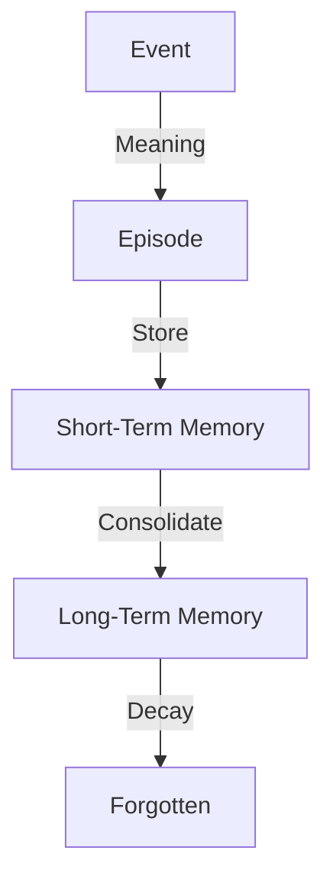

# Основные концепции проекта Life

Этот файл содержит описание ключевых концепций системы Life, объединенных для удобства чтения и поддержки.

## 16_GOALS.md — Целеполагание

### Концепция
Goals в Life — это не "желания" (Desires) и не "намерения" (Intentions).
Это **вектор развития**. Это абстрактные направления, куда система может двигаться, если у нее есть избыток энергии.

### Принципы работы

1. **Пассивность:** Цели не "тянут" Life за собой. Они лежат и ждут, пока Life обратит на них внимание.
2. **Абстрактность:** Цель — это не "сделать X", а "стать Y" (например, "стать более устойчивым").
3. **Множественность:** Может быть много конкурирующих целей.

### Механизм

1. **Formation:** Цели формируются на основе Adaptation (например, "часто больно -> надо стать крепче").
2. **Selection:** Decision Maker может выбрать действие, которое способствует цели, если это действие также удовлетворяет текущие потребности.

### Ограничения (Limits)

1. **Запрет на волю:** Life не может "захотеть" достичь цели вопреки инстинктам самосохранения.
2. **Запрет на планирование:** Цель не создает план действий. Она лишь подсвечивает выгодные действия.

### Связь с другими модулями

* **Adaptation:** Источник целей.
* **Decision:** Потребитель (учитывает цели как дополнительный вес).

---

## 13_FEEDBACK.md — Обратная связь

### Концепция
Feedback — это механизм восприятия последствий своих действий.
Это не "оценка" (хорошо/плохо), а "факт изменения" (было -> стало).

### Принципы работы

1. **Объективность:** Feedback фиксирует физические изменения в среде или в себе.
2. **Асинхронность:** Последствия могут наступать не сразу после действия.
3. **Безоценочность:** Feedback не говорит "ты молодец". Он говорит "энергия упала на 5%".

### Процесс

1. **Action:** Life совершает действие.
2. **Observation:** Среда или тело меняются.
3. **Registration:** Изменение фиксируется как Feedback Event.
4. **Association:** Feedback связывается с совершенным действием (если связь очевидна).

### Ограничения (Limits)

1. **Запрет на успех/неудачу:** Feedback не содержит флагов `success` или `failure`.
2. **Запрет на коррекцию:** Feedback сам по себе не запускает исправление ошибок. Это задача Learning/Adaptation.
3. **Запрет на обучение:** Feedback — это данные для обучения, а не сам процесс обучения.

### Связь с другими модулями

* **Action:** Источник изменений.
* **Environment:** Среда, где происходят изменения.
* **Learning:** Потребитель Feedback для настройки параметров.

---

## 09_MEMORY.md — Память и Опыт

### Концепция
Память в Life — это не база данных фактов, а **след прожитого опыта**.
Life помнит не всё, а только то, что оставило эмоциональный (значимый) отпечаток.

### Принципы работы

1. **Эпизодичность:** Память состоит из эпизодов (Events + Meaning).
2. **Ассоциативность:** Доступ к памяти происходит не по ID, а по сходству контекста (Activation).
3. **Забывание:** Память, которая не активируется, со временем стирается или архивируется.
4. **Искажение:** При каждом воспоминании (Recall) память может немного изменяться.

### Структура памяти

#### Episode (Эпизод)
Единица хранения. Содержит:
* Слепок события (Event).
* Субъективное значение (Meaning).
* Контекст состояния (Self-State snapshot).

### Ограничения (Limits)

1. **Не всеведущность:** Life не помнит всего.
2. **Не точность:** Память не является точной записью (как лог). Это реконструкция.
3. **Не база знаний:** Память хранит *личный опыт*, а не факты о мире (Википедию).

### Связь с другими модулями

* **Meaning Engine:** Создает материал для памяти.
* **Activation:** Механизм извлечения памяти (см. [activation-concept.md](activation-concept.md)).
