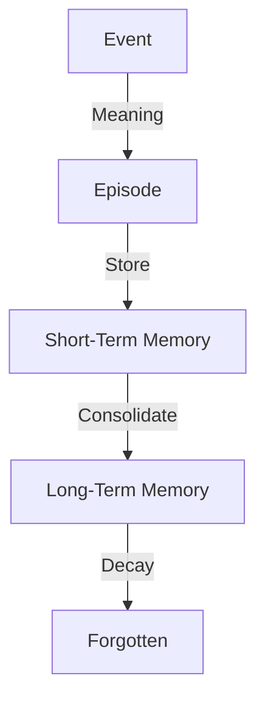

# 09_MEMORY.md — Память и Опыт

## Концепция
Память в Life — это не база данных фактов, а **след прожитого опыта**.
Life помнит не всё, а только то, что оставило эмоциональный (значимый) отпечаток.

## Принципы работы

1.  **Эпизодичность:** Память состоит из эпизодов (Events + Meaning).
2.  **Ассоциативность:** Доступ к памяти происходит не по ID, а по сходству контекста (Activation).
3.  **Забывание:** Память, которая не активируется, со временем стирается или архивируется.
4.  **Искажение:** При каждом воспоминании (Recall) память может немного изменяться.

## Структура памяти

### Episode (Эпизод)
Единица хранения. Содержит:
*   Слепок события (Event).
*   Субъективное значение (Meaning).
*   Контекст состояния (Self-State snapshot).

## Ограничения (Limits)

1.  **Не всеведущность:** Life не помнит всего.
2.  **Не точность:** Память не является точной записью (как лог). Это реконструкция.
3.  **Не база знаний:** Память хранит *личный опыт*, а не факты о мире (Википедию).

## Связь с другими модулями

*   **Meaning Engine:** Создает материал для памяти.
*   **Activation:** Механизм извлечения памяти (см. [10_ACTIVATION.md](10_ACTIVATION.md)).
