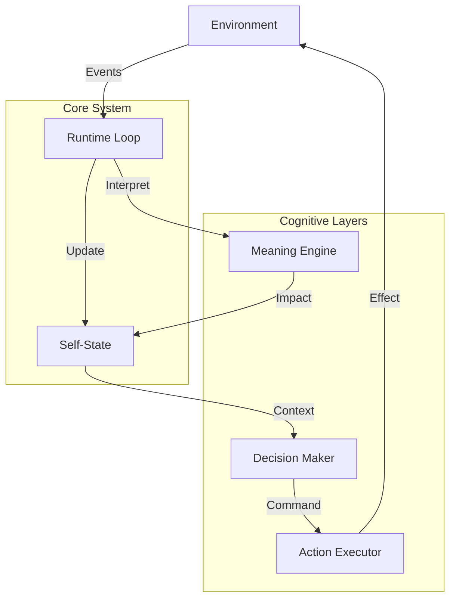

# 01_ARCHITECTURE.md — Архитектура системы

## Обзор

Архитектура Life построена по принципу **слоеного пирога**, где каждый следующий слой опирается на предыдущий, но не управляет им напрямую.

## Слои системы

### 1. Runtime Loop (Сердцебиение)
Центральный цикл, который обеспечивает течение времени.
*   **Роль:** Оркестрация всех процессов.
*   **Документация:** [02_RUNTIME_LOOP.md](../system/02_RUNTIME_LOOP.md)

### 2. Self-State (Тело)
Хранилище текущего состояния системы.
*   **Роль:** Поддержание гомеостаза, накопление усталости, энергии, возраста.
*   **Документация:** [03_SELF_STATE.md](../system/03_SELF_STATE.md)

### 3. Environment (Среда)
Источник внешних событий и неопределенности.
*   **Роль:** Генерация стимулов (шум, шок, восстановление).
*   **Документация:** [07_ENVIRONMENT.md](../system/07_ENVIRONMENT.md)

### 4. Meaning Engine (Восприятие)
Интерпретатор событий. Переводит объективные факты в субъективный опыт.
*   **Роль:** Оценка значимости событий для конкретного состояния Life.
*   **Документация:** [08_EVENTS_AND_MEANING.md](../system/08_EVENTS_AND_MEANING.md)

### 5. Monitor (Наблюдатель)
Инструмент для внешнего наблюдения за системой.
*   **Роль:** Визуализация состояния без вмешательства.
*   **Документация:** [04_MONITOR.md](../system/04_MONITOR.md)

### 6. API Server (Интерфейс)
Точка входа для управления и интеграции.
*   **Роль:** Запуск, остановка, подача внешних сигналов.
*   **Документация:** [06_API_SERVER.md](../system/06_API_SERVER.md)

## Потоки данных

1.  **Входящий поток:** Environment -> Event Queue -> Runtime Loop -> Meaning Engine -> Self-State Update.
2.  **Исходящий поток:** Self-State -> Decision Maker -> Action Executor -> Environment / Internal Change.
3.  **Поток наблюдения:** Self-State -> Monitor -> Logs / Console.

## Принципы взаимодействия

*   **Асинхронность:** Среда живет своей жизнью, Life — своей.
*   **Изоляция:** Слои знают только о соседях. Decision не знает о деталях реализации Loop.
*   **Необратимость:** Изменения в Self-State нельзя отменить, только компенсировать новыми изменениями.
