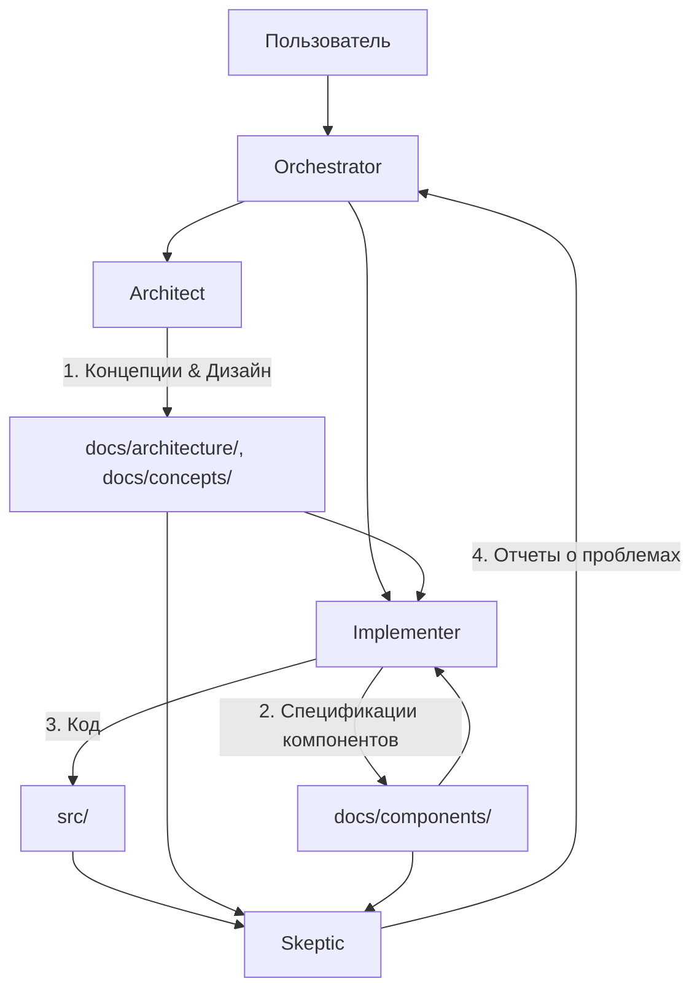

# Обзор системы агентов проекта Life

Проект Life разрабатывается с использованием специализированных ролей LLM-агентов. Каждая роль имеет четкую зону ответственности, набор доступных инструментов и специфические инструкции.

## Роли агентов

| Роль | Режим (Mode) | Основная задача | Зона ответственности (Файлы) |
|------|--------------|-----------------|------------------------------|
| **Architect** | `architect` | Проектирование, стратегия, видение | `docs/architecture/`, `docs/concepts/`, `docs/development/` |
| **Implementer** | `code` | Реализация, детализация систем | `docs/components/`, `src/` |
| **Skeptic** | `code-skeptic` | Критика, поиск ошибок, проверка | Весь проект (Read-only), отчеты в `docs/reviews/` |
| **Orchestrator** | `orchestrator` | Планирование, координация | `todo/`, `plans/`, управление задачами |

## Схема взаимодействия

## Принципы работы

1.  **Разделение труда:** Не пытайтесь делать всё сразу. Если вы в режиме Architect, не пишите код реализации. Если вы Implementer, не меняйте фундаментальные принципы без согласования.
2.  **Документация как контракт:** Агенты общаются через документацию. Architect создает концепт, Implementer превращает его в системную документацию и код.
3.  **Итеративность:** Работа ведется небольшими, законченными шагами.
4.  **Переключение контекста:** Используйте `switch_mode` для перехода к нужной роли, если текущая задача выходит за рамки вашей компетенции.

## Подробные инструкции

*   [Инструкция Architect](agent-architect.md)
*   [Инструкция Implementer](agent-implementer.md)
*   [Инструкция Skeptic](agent-skeptic.md)
*   [Инструкция Orchestrator](agent-orchestrator.md)
