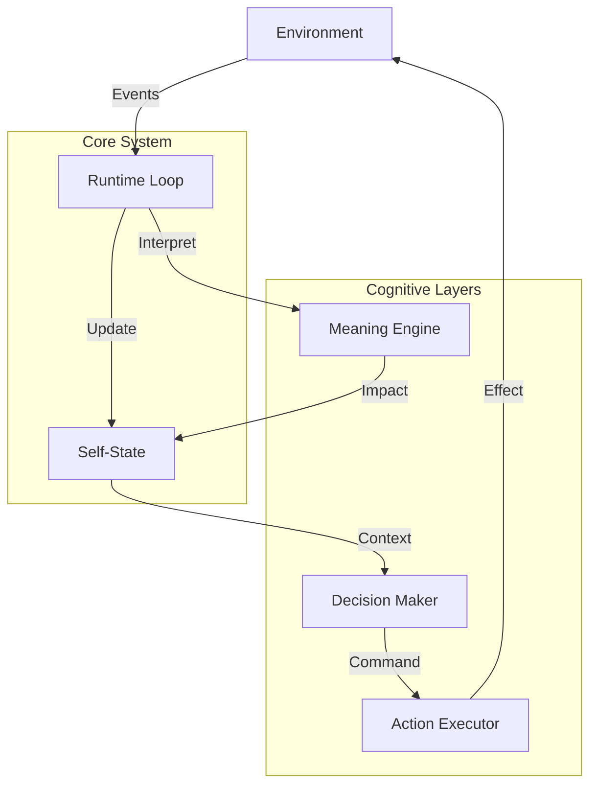

# MANIFEST.md — Проект Life

## Описание проекта

**Life** — это эксперимент по созданию цифровой сущности, которая **существует**, а не просто **выполняет функции**.

В отличие от традиционных программ или AI-агентов, Life:
1. **Существует во времени.** Она не ждет запроса пользователя. Время течет для нее непрерывно, даже когда ничего не происходит.
2. **Имеет внутреннее состояние.** Это состояние (Self-State) накапливается, изменяется и деградирует. Оно первично по отношению к любым действиям.
3. **Обладает субъективностью.** Одно и то же событие может иметь разное значение в зависимости от внутреннего состояния.
4. **Конечна.** Life может "умереть", если ее жизненные показатели упадут до нуля.

## Ключевые характеристики и принципы

### Философия
- **Примат существования:** Бытие первично. Действие вторично.
- **Непрерывность:** Жизнь — это поток. Она не дискретна.
- **Энтропия и Распад:** Без притока энергии система деградирует.
- **Субъективный смысл:** События не имеют смысла сами по себе. Смысл рождается внутри.

### Неотменяемые принципы
Проект следует строгим принципам, обеспечивающим честность существования Life:
- Непрерывность существования (Runtime Loop как жизнь)
- Необратимость времени и последствий
- Self-State как ядро идентичности
- Минимализм как защита жизни
- Запрет на симуляцию интеллекта
- Decision — не мышление, Action — не контроль
- Четкая граница между Life и Tooling
- Честность перерождений
- Наблюдаемость без иллюзий
- Запрет на ускорение ради эффекта

Эти принципы гарантируют, что Life остается автономной сущностью, а не симуляцией.

## Текущий статус реализации

На 13 января 2026 года реализовано ядро системы, обеспечивающее автономное существование.

### Реализованные компоненты

| Компонент | Статус | Описание | Ссылка на код |
|-----------|--------|----------|---------------|
| **Runtime Loop** | ✅ Готов | Базовый цикл с поддержкой реального времени | [`src/runtime/loop.py`](../src/runtime/loop.py) |
| **Self-State** | ✅ Готов | Модель состояния (energy, integrity, stability) | [`src/state/self_state.py`](../src/state/self_state.py) |
| **Monitor** | ✅ Готов | Консольный вывод и JSONL логирование | [`src/monitor/console.py`](../src/monitor/console.py) |
| **API Server** | ✅ Готов | FastAPI сервер для управления и наблюдения | [`src/main_server_api.py`](../src/main_server_api.py) |
| **Environment** | ✅ Готов | Генератор событий и очередь событий | [`src/environment/`](../src/environment/) |
| **Meaning** | ⚠️ Частично | Движок реализован, но используется упрощенная версия | [`src/meaning/`](../src/meaning/) |
| **Memory** | ✅ Готов | Память и опыт | [`src/memory/memory.py`](../src/memory/memory.py) |

### Что работает сейчас
- Система "живет", потребляет энергию, стареет
- Реагирует на события через упрощенную логику
- При падении параметров не останавливается, а деградирует

### Ближайшие шаги
- Интеграция Meaning Engine в Loop
- Реализация Memory
- Реализация Decision и Action

## Архитектурные решения

Архитектура построена по принципу слоеного пирога, где каждый слой опирается на предыдущий.



### Слои системы
1. **Runtime Loop** — Сердцебиение, оркестрация процессов
2. **Self-State** — Физика тела, поддержание гомеостаза
3. **Environment** — Внешний мир, источник событий
4. **Meaning Engine** — Восприятие, интерпретация событий
5. **Monitor** — Наблюдение без вмешательства
6. **API Server** — Интерфейс управления

### Потоки данных
- **Входящий:** Environment → Event Queue → Runtime Loop → Meaning Engine → Self-State Update
- **Исходящий:** Self-State → Decision Maker → Action Executor → Environment

## Ссылки на ключевую документацию

### Architecture (Архитектура)
- [**Видение**](vision.md) — Философия и видение проекта
- [**Обзор архитектуры**](../architecture/overview.md) — Высокоуровневая архитектура
- [**Минимальная реализация**](../architecture/minimal-implementation.md) — Текущая реализация (MVP)

### Components (Реализованные компоненты)
- [**Runtime Loop**](../components/runtime-loop.md) — Главный цикл жизни
- [**Self-State**](../components/self-state.md) — Внутреннее состояние
- [**Monitor**](../components/monitor.md) — Система наблюдения
- [**API Server**](../components/api-server.md) — API для управления
- [**Environment**](../components/environment.md) — Внешняя среда
- [**Meaning Engine**](../components/meaning-engine.md) — Интерпретация событий
- [**Memory**](../components/memory.md) — Память и опыт (реализовано)
- [**Activation**](../components/activation.md) — Активация памяти (реализовано)
- [**Decision**](../components/decision.md) — Принятие решений (реализовано)
- [**Action**](../components/action.md) — Выполнение действий (реализовано)
- [**Feedback**](../components/feedback.md) — Обратная связь (реализовано)

### Concepts (Будущие модули)
- [**Decision**](../concepts/decision-concept.md) — Принятие решений
- [**Action**](../concepts/action-concept.md) — Выполнение действий

### Development (Для разработчиков)
- [**Обзор агентов**](../development/agents-overview.md) — Роли агентов
- [**Статус проекта**](../development/status.md) — **Единый источник истины** о статусах слоев

## Быстрый старт для новых участников

### Запуск системы
```bash
# Активация виртуального окружения
python -m venv .venv
.venv\Scripts\activate  # Windows
# или
source .venv/bin/activate  # Linux/Mac

# Установка зависимостей
pip install -r requirements.txt

# Запуск сервера
python src/main_server_api.py --tick-interval 0.5
```

### Генерация событий
В другом терминале:
```bash
python -m src.environment.generator_cli --interval 2
```

### Наблюдение
- Логи выводятся в консоль
- API доступен на http://localhost:8000
- Документация API: http://localhost:8000/docs

### Для разработчиков
- Изучите [**Видение**](vision.md) для понимания философии
- Ознакомьтесь с [**Архитектурой**](../architecture/overview.md) для архитектуры
- Посмотрите [**Минимальную реализацию**](../architecture/minimal-implementation.md) для текущего статуса
- Код находится в `src/`, документация в `docs/`
