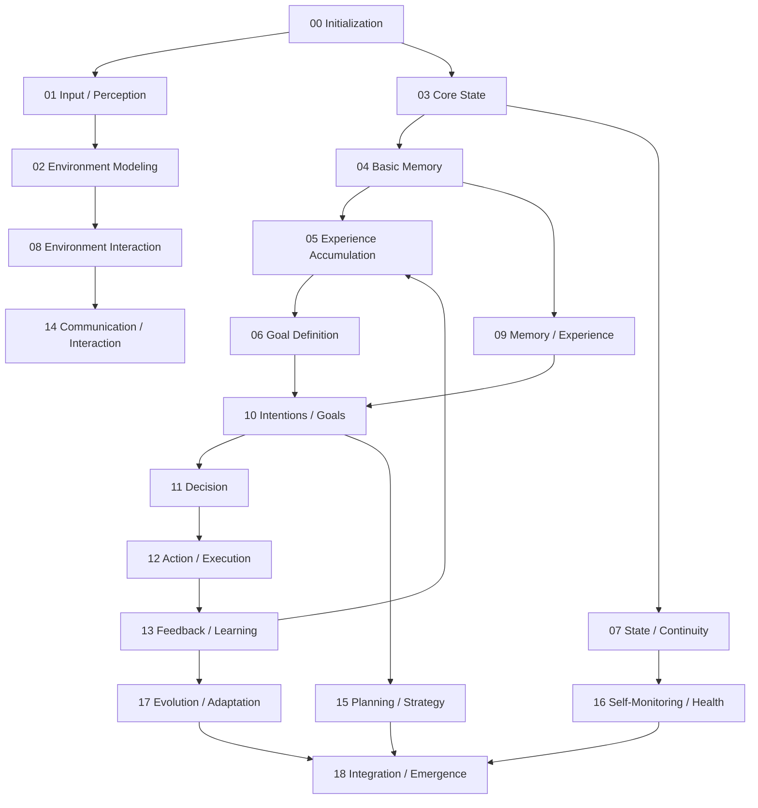
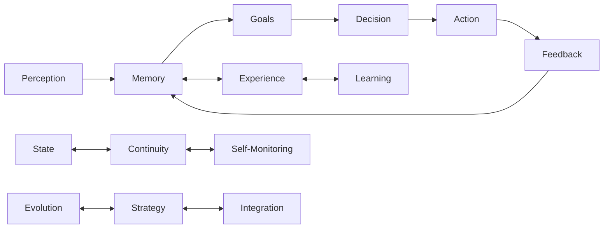
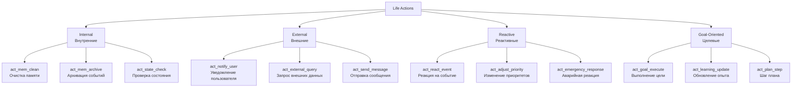
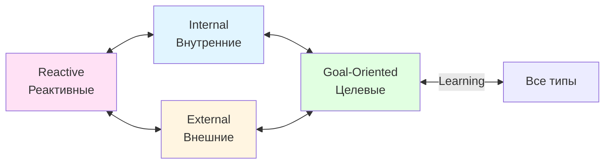
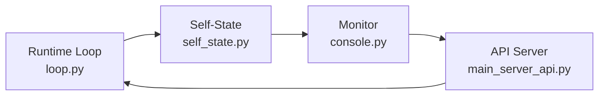
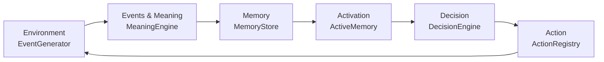
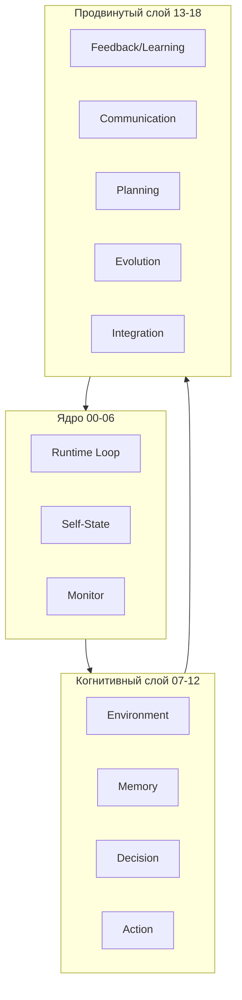

Давай выстроим полную структуру Life от 00 до 18 с текущими слоями и этапами, добавим визуализацию процессов (дерево), чтобы это стало основой для дальнейшей доработки и реализации.

Я предлагаю оформить в Markdown с иерархией этапов и слоев, плюс схематическое дерево с потоками данных и зависимостями.

Вот пример содержимого _project_tree.md:

# Life: Project Tree (_project_tree.md)

## Общая структура
Life строится на принципах постепенного усложнения, автономности слоев и этапов, минимализма реализации и непрерывности существования.  
Каждый этап автономен, реализуется только после полной фиксации документации.

---

## Этапы и слои

### 00. Initialization
- Цель: подготовка среды Life
- Слои:
  - System Boot
  - Configuration Loader
  - Basic Logging

### 01. Input / Perception
- Цель: получение информации о внешнем мире
- Слои:
  - Sensor Interface
  - Data Normalization
  - Event Queue

### 02. Environment Modeling
- Цель: формирование модели внешней среды
- Слои:
  - World State
  - Entities & Relationships
  - Dynamic Simulation

### 03. Core State
- Цель: поддержание внутреннего состояния Life
- Слои:
  - Variables & Parameters
  - State Versioning
  - Continuity Checks

### 04. Basic Memory
- Цель: хранение недолговременного опыта
- Слои:
  - Short-Term Storage
  - Event Recording
  - Contextual Snapshot

### 05. Experience Accumulation
- Цель: накопление долгосрочного опыта
- Слои:
  - Long-Term Memory
  - Pattern Recognition
  - Historical Indexing

### 06. Goal Definition
- Цель: формирование намерений и целей
- Слои:
  - Intent Generator
  - Priority Assignment
  - Goal Hierarchy

### 07. State / Continuity
- Цель: проверка согласованности внутреннего состояния
- Слои:
  - State Validation
  - Continuity Assurance
  - Error Detection

### 08. Environment Interaction
- Цель: взаимодействие с внешней средой
- Слои:
  - Action Interfaces
  - Observation Feedback
  - External Constraints

### 09. Memory / Experience
- Цель: фиксирование опыта и границ памяти
- Слои:
  - Experience Logger
  - Memory Boundaries
  - Recall Mechanisms

### 10. Intentions / Goals
- Цель: определение целей на основе памяти и состояния
- Слои:
  - Goal Selector
  - Conflict Resolver
  - Task Scheduler

### 11. Decision
- Цель: принятие решений на основе состояния, целей и опыта
- Слои:
  - Decision Engine
  - Option Evaluation
  - Risk Assessment

### 12. Action / Execution
- Цель: выполнение действий в среде
- Слои:
  - Action Planner
  - Execution Engine
  - Outcome Logging

### 13. Feedback / Learning
- Цель: анализ результатов действий и самокоррекция
- Слои:
  - Outcome Analyzer
  - Learning Module
  - Adaptive Adjustment

### 14. Communication / Interaction
- Цель: взаимодействие с внешними агентами
- Слои:
  - Communication Protocols
  - Message Prioritization
  - Interface Adapters

### 15. Planning / Strategy
- Цель: формирование долгосрочных планов
- Слои:
  - Scenario Builder
  - Resource Forecast
  - Strategy Selector

### 16. Self-Monitoring / Health
- Цель: контроль целостности и ресурсов Life
- Слои:
  - Module Health Checks
  - Resource Management
  - Logging & Alerts

### 17. Evolution / Adaptation
- Цель: самостоятельная модификация и развитие
- Слои:
  - Module Generation
  - Structure Adaptation
  - Experimental Algorithms

### 18. Integration / Emergence
- Цель: объединение всех слоев в согласованное целое
- Слои:
  - Goal-State Alignment
  - Resource Distribution
  - Continuity Maintenance

---

## Визуализация процессов

### Этапы Life (Концептуальная иерархия)



### Потоки данных



---

*Примечание:*  
Это **текущая основа**, к которой будем **привязывать реализацию модулей**, добавлять подслои, уточнять интерфейсы и зависимости.  
Дерево служит как **контрольная структура**, чтобы ни один слой не нарушал целостность Life.


## Типология действий Life

### Классификация действий



### Взаимосвязи типов действий



### Описание типов

**Internal (Внутренние)** — поддерживают состояние Life, обеспечивают чистоту и порядок, минимизируют нагрузку.

**External (Внешние)** — обеспечивают связь Life с внешним миром, позволяют Life влиять и получать данные извне.

**Reactive (Реактивные)** — обеспечивают адаптивность, позволяют Life реагировать на изменения среды и событий.

**Goal-Oriented (Целевые)** — движущая сила Life, направленная на достижение целей и обучение на опыте.

### Принципы взаимодействия:
- Internal ↔ Goal-Oriented: внутренние действия подготавливают среду для достижения целей
- External ↔ Goal-Oriented: внешние действия реализуют цели в мире
- Reactive ↔ Internal / External: реакции корректируют внутреннее состояние или внешние действия в реальном времени
- Learning (целевые) ↔ все остальные: обновление опыта используется для оптимизации всех типов действий

---

## Реальная структура проекта

### Файловая структура

```
life/
├── docs/                                        # Документация проекта
│   ├── 00_VISION.md                            # Концепция проекта Life
│   ├── 01_ARCHITECTURE.md                      # Архитектура системы
│   ├── 01.1 runtime-скелет.md                  # Исторический скелет
│   ├── 02_RUNTIME_LOOP.md                      # Runtime Loop - ядро жизни
│   ├── 02.1 интерпретации.md                   # Интерпретация поведения Life
│   ├── 03_SELF_STATE.md                        # Внутреннее состояние Я
│   ├── 04_MONITOR.md                           # Система наблюдения
│   ├── 04.0 Pre_MONITOR.md                     # Предварительные идеи мониторинга
│   ├── 05_MINIMAL_IMPLEMENTATION.md            # Минимальная реализация
│   ├── 06_API_SERVER.md                        # HTTP API сервер
│   ├── 07_ENVIRONMENT.md                       # Среда и события
│   ├── 08_EVENTS_AND_MEANING.md                # События и их значение
│   ├── 09_MEMORY_AND_EXPERIENCE.md             # Память и опыт
│   ├── 10_Activation_and_Recall.md             # Активация памяти
│   ├── 11_Decision.md                          # Принятие решений
│   ├── 12_ACTION_AND_EXECUTION.md              # Действия и исполнение
│   ├── _project_tree.md                        # Структура проекта (этот файл)
│   ├── auto-reload-plan.md                     # План авто-перезагрузки
│   ├── life Диаграмма действий жизни.png       # Визуализация действий
│   ├── notes.md                                # Заметки
│   ├── now.md                                  # Текущие задачи
│   └── todo_00-06.md                           # TODO этапы 00-06
├── src/                                        # Исходный код
│   ├── main_server_api.py                      # Основной API сервер с dev mode
│   ├── main.py                                 # Тестовый запуск (устаревший)
│   ├── runtime/
│   │   └── loop.py                             # Runtime Loop реализация
│   ├── state/
│   │   └── self_state.py                       # Управление состоянием
│   └── monitor/
│       └── console.py                           # Консольный мониторинг
│   ├── environment/
│   │   ├── __init__.py          # Экспорт Event, EventQueue, EventGenerator
│   │   ├── event.py             # Структура Event (dataclass)
│   │   ├── event_queue.py       # Очередь событий (thread-safe)
│   │   └── generator.py         # Генератор событий
│   └── meaning/
│       ├── __init__.py          # Экспорт Meaning, MeaningEngine
│       ├── meaning.py           # Структура Meaning (dataclass)
│       └── engine.py            # Движок интерпретации событий
├── data/                                       # Данные и логи
│   ├── tick_log.jsonl                          # Логи тиков
│   └── snapshots/                              # Снапшоты состояния
│       └── snapshot_XXXXXX.json                # Файлы снапшотов
├── plans/                                      # Планы и стратегии
│   └── project_tree_update_plan.md             # План обновления документации
├── .gitignore                                  # Исключаемые файлы
├── .venv/                                      # Виртуальное окружение Python
├── .vscode/                                    # Настройки VS Code
└── README.md                                   # Основная документация проекта
```

### Ключевые файлы проекта

**Документация:**
- [`00_VISION.md`](../core/00_VISION.md) - Концепция проекта Life
- [`01_ARCHITECTURE.md`](../core/01_ARCHITECTURE.md) - Архитектура системы
- [`02_RUNTIME_LOOP.md`](../system/02_RUNTIME_LOOP.md) - Runtime Loop - ядро жизни
- [`03_SELF_STATE.md`](../system/03_SELF_STATE.md) - Внутреннее состояние Я
- [`04_MONITOR.md`](../system/04_MONITOR.md) - Система наблюдения
- [`05_MINIMAL_IMPLEMENTATION.md`](../core/05_MINIMAL_IMPLEMENTATION.md) - Минимальная реализация
- [`06_API_SERVER.md`](../system/06_API_SERVER.md) - HTTP API сервер
- [`07_ENVIRONMENT.md`](../system/07_ENVIRONMENT.md) - Среда и события (концепция)
- [`08_EVENTS_AND_MEANING.md`](../system/08_EVENTS_AND_MEANING.md) - События и их значение (концепция)
- [`09_MEMORY_AND_EXPERIENCE.md`](../concepts/09_MEMORY.md) - Память и опыт (концепция)
- [`10_Activation_and_Recall.md`](../concepts/10_ACTIVATION.md) - Активация памяти (концепция)
- [`11_Decision.md`](../concepts/11_DECISION.md) - Принятие решений (концепция)
- [`12_ACTION_AND_EXECUTION.md`](../concepts/12_ACTION.md) - Действия и исполнение (концепция)

**Исходный код:**
- [`main_server_api.py`](../src/main_server_api.py) - Точка входа с API и dev mode
- [`main.py`](../src/main.py) - Тестовый запуск (устаревший)
- [`runtime/loop.py`](../src/runtime/loop.py) - Runtime Loop (ядро жизни)
- [`state/self_state.py`](../src/state/self_state.py) - Управление состоянием
- [`monitor/console.py`](../src/monitor/console.py) - Консольный мониторинг
- [`environment/__init__.py`](../src/environment/__init__.py) - Инициализация модуля Environment
- [`environment/event.py`](../src/environment/event.py) - Структура Event
- [`environment/event_queue.py`](../src/environment/event_queue.py) - Очередь событий
- [`environment/generator.py`](../src/environment/generator.py) - Генератор событий
- [`meaning/__init__.py`](../src/meaning/__init__.py) - Инициализация модуля Meaning
- [`meaning/meaning.py`](../src/meaning/meaning.py) - Структура Meaning
- [`meaning/engine.py`](../src/meaning/engine.py) - Движок интерпретации событий

**Планы:**
- [`project_tree_update_plan.md`](../plans/project_tree_update_plan.md) - План обновления документации

**Изменения структуры:**
- ✅ Функционал интегрирован в [`state/self_state.py`](../src/state/self_state.py)
- ❌ Удален `pyrightconfig.json` - не используется в проекте

---

## Mapping этапов и файлов кода

| Этап | Документ | Реализация | Статус |
|------|----------|------------|---------|
| 00 | [`00_VISION.md`](../core/00_VISION.md) | Концептуальный уровень | ✓ Завершен |
| 01 | [`01_ARCHITECTURE.md`](../core/01_ARCHITECTURE.md) | Вся структура `src/` | ✓ Реализован |
| 02 | [`02_RUNTIME_LOOP.md`](../system/02_RUNTIME_LOOP.md) | [`runtime/loop.py`](../src/runtime/loop.py) | ✓ Реализован |
| 03 | [`03_SELF_STATE.md`](../system/03_SELF_STATE.md) | [`state/self_state.py`](../src/state/self_state.py) | ✓ Реализован |
| 04 | [`04_MONITOR.md`](../system/04_MONITOR.md) | [`monitor/console.py`](../src/monitor/console.py) | ✓ Реализован |
| 05 | [`05_MINIMAL_IMPLEMENTATION.md`](../core/05_MINIMAL_IMPLEMENTATION.md) | Все модули `src/` | ✓ Реализован |
| 06 | [`06_API_SERVER.md`](../system/06_API_SERVER.md) | [`main_server_api.py`](../src/main_server_api.py) | ✓ Реализован |
| 07 | [`07_ENVIRONMENT.md`](../system/07_ENVIRONMENT.md) | [`src/environment/`](../src/environment/) | ✓ Реализован |
| 08 | [`08_EVENTS_AND_MEANING.md`](../system/08_EVENTS_AND_MEANING.md) | [`src/meaning/`](../src/meaning/) | 🔄 Частично реализован (MeaningEngine готов, но интеграция в loop.py отсутствует) |
| 09 | [`09_MEMORY_AND_EXPERIENCE.md`](../concepts/09_MEMORY.md) | Не реализовано | ⏳ Концепция |
| 10 | [`10_Activation_and_Recall.md`](../concepts/10_ACTIVATION.md) | Не реализовано | ⏳ Концепция |
| 11 | [`11_Decision.md`](../concepts/11_DECISION.md) | Не реализовано | ⏸ Blocked |
| 12 | [`12_ACTION_AND_EXECUTION.md`](../concepts/12_ACTION.md) | Не реализовано | 🚫 Forbidden |
| 13 | [`13_FEEDBACK_LIMITS.md`](13_FEEDBACK_LIMITS.md) | Не реализовано | 📋 Планируется |
| 14 | 14_COMMUNICATION.md | Не реализовано | 📋 Планируется |
| 15 | 15_PLANNING_STRATEGY.md | Не реализовано | 📋 Планируется |
| 16 | 16_SELF_MONITORING.md | Частично ([`monitor/console.py`](../src/monitor/console.py)) | 🔄 В разработке |
| 17 | 17_EVOLUTION.md | Не реализовано | 📋 Планируется |
| 18 | 18_INTEGRATION.md | Не реализовано | 📋 Планируется |

### Легенда статусов:
- ✓ **Реализован** - Этап полностью реализован в коде
- ⏳ **Концепция** - Документация создана, код не реализован
- 🔄 **В разработке** - Этап частично реализован
- 📋 **Планируется** - Документация ещё не создана, этап в планах

---

## Статус этапов 07-12

### Этап 07: Environment (Среда)
**Статус:** ✓ Реализован и протестирован

**Что реализовано:**
- **Event** (`src/environment/event.py`): Dataclass с полями `type`, `intensity`, `timestamp`, `metadata`
- **EventQueue** (`src/environment/event_queue.py`): Thread-safe очередь на `queue.Queue` с методами:
  - `push()` - добавление события
  - `pop()` - извлечение одного события (FIFO)
  - `pop_all()` - извлечение всех событий за тик
  - `is_empty()`, `size()` - проверка состояния
- **EventGenerator** (`src/environment/generator.py`): Генератор событий с правильными диапазонами интенсивности:
  - `noise`: `[-0.3, 0.3]`
  - `decay`: `[-0.5, 0.0]`
  - `recovery`: `[0.0, 0.5]`
  - `shock`: `[-1.0, 1.0]`
  - `idle`: `0.0`
- **API** (`src/main_server_api.py`):
  - GET `/status`, `/clear-data`
  - POST `/event` — добавление событий в очередь среды
- **Внешний генератор** (`src/environment/generator_cli.py`):
  - Отдельный процесс/терминал, отправляет события на API с указанным интервалом
- **Интеграция в Runtime Loop** (`src/runtime/loop.py`):
  - `_interpret_event()` для простой интерпретации событий
  - Обработка всех событий за тик через `pop_all()`
  - События влияют на `energy`, `stability`, `integrity`

**Принципы реализации:**
- Environment независим от Life (не знает о внутренностях)
- События приходят извне: через API или внешний генератор (серверный поток не генерирует сам)
- Life интерпретирует события через простую функцию (не MeaningEngine на этапе 07)
- Все события обрабатываются за один тик

**Следующие шаги:**
- Этап завершен, переход к 08_EVENTS_AND_MEANING

### Этап 08: Events & Meaning (События и значение)
**Статус:** Реализован

**Что реализовано:**
- Модуль [`src/meaning/`](../src/meaning/) с [`Meaning`](../src/meaning/meaning.py) dataclass и [`MeaningEngine`](../src/meaning/engine.py)
- Meaning структура: event_id, significance [0.0-1.0], impact {energy, stability, integrity}
- MeaningEngine с методами: appraisal(), impact_model(), response_pattern(), process()
- Интеграция в [`Runtime Loop`](../src/runtime/loop.py): события интерпретируются через MeaningEngine
- Паттерны реакции: ignore, absorb, dampen, amplify
- Формула Meaning = f(Event, SelfState) — субъективная интерпретация событий

**Следующие шаги:**
- Этап завершен, переход к 09_MEMORY_AND_EXPERIENCE

### Этап 09: Memory & Experience (Память и опыт)
**Статус:** Концепция разработана, реализация не начата

**Что описано:**
- Типы памяти: эпизодическая, поведенческая, контекстная
- Experience как связка событий
- Забывание и деградация
- Графовая модель памяти

**Следующие шаги:**
- Реализация Memory Store
- Формирование опыта из событий
- Механизмы забывания

### Этап 10: Activation & Recall (Активация и воспроизведение)
**Статус:** Концепция разработана, реализация не начата

**Что описано:**
- Active Memory vs Memory Store
- Триггеры активации
- Recall как восстановление паттерна
- Ограничения и затухание

**Следующие шаги:**
- Реализация механизма активации
- Active Memory с TTL
- Интеграция с Memory Store

### Этап 11: Decision (Решения)
**Статус:** Концепция разработана, реализация не начата

**Что описано:**
- Decision как выбор следующего шага
- Входы: State, Environment, Active Memory
- Пространство решений
- Ошибочные решения как норма

**Следующие шаги:**
- Реализация Decision Engine
- Интеграция с Active Memory
- Тестирование различных сценариев

### Этап 12: Action & Execution (Действия и исполнение)
**Статус:** Концепция разработана, реализация не начата

**Что описано:**
- Реестр действий Life
- Типы действий: внутренние, внешние, реактивные, целевые
- Принципы исполнения
- Атомарность и проверяемость

**Следующие шаги:**
- Создание Action Registry
- Реализация базовых действий
- Интеграция с Decision

---

## Архитектурные связи

### Текущая реализация (этапы 00-06)



### Будущая архитектура (этапы 07-12)



### Перспективная архитектура (этапы 13-18)



### Ключевые зависимости
- **Environment** должен быть независим от Life
- **Memory** не должна нарушать непрерывность State
- **Decision** работает только с локальным контекстом
- **Action** атомарны и обратимы
- **Learning** использует Feedback для адаптации
- **Integration** обеспечивает согласованность всех слоев

---

## Roadmap развития

### Приоритет 1: Завершение когнитивного слоя (07-12)

**Следующие шаги:**
1. **Этап 07: Environment** - ✓ Реализован
2. **Этап 08: Events & Meaning** - Интерпретация событий
3. **Этап 09: Memory & Experience** - Система памяти

**Зависимости:**
- 07 → 08 → 09 (последовательная реализация)
- После 09 возможна параллельная работа над 10-12

### Приоритет 2: Механизмы активации и решений (10-12)

**Следующие шаги:**
1. **Этап 10: Activation & Recall** - Активная память
2. **Этап 11: Decision** - Принятие решений
3. **Этап 12: Action & Execution** - Выполнение действий

**Зависимости:**
- 09 → 10 → 11 → 12 (последовательная реализация)

### Приоритет 3: Самообучение и адаптация (13-15)

**Планируемые этапы:**
- **Этап 13: Feedback / Learning** - Обучение на результатах
- **Этап 14: Communication** - Взаимодействие с агентами
- **Этап 15: Planning / Strategy** - Долгосрочное планирование

**Условие начала:** Завершение этапов 07-12

### Приоритет 4: Целостность и эволюция (16-18)

**Планируемые этапы:**
- **Этап 16: Self-Monitoring / Health** - Расширение мониторинга
- **Этап 17: Evolution / Adaptation** - Саморазвитие
- **Этап 18: Integration / Emergence** - Интегральное целое

**Условие начала:** Завершение этапов 13-15

### Критерии готовности каждого этапа:
- ✓ Документация завершена и проверена
- ✓ Код реализован и протестирован
- ✓ Интеграция с предыдущими этапами проверена
- ✓ Не нарушены принципы Life (непрерывность, необратимость, минимализм)

---

*Последнее обновление: 2026-01-08 (этап 07 Environment реализован и протестирован)*

