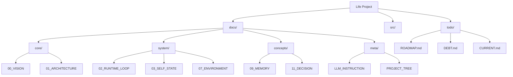

# План реорганизации документации проекта Life

## 1. Анализ текущей ситуации

**Проблемы:**
- **Плоская структура:** Все файлы лежат в корне `docs/`, смешивая концепции, реализацию и планы.
- **Смешение статусов:** Реализованные модули (00-08) лежат рядом с концептуальными (09-18) без явного разделения.
- **Дублирование:** `_project_tree.md` дублирует структуру, описанную в именах файлов.
- **Размытость TODO:** Задачи разбросаны по `todo/`, `now.md`, `notes.md`.
- **Инструкции:** `LLM_instruction.md` требует уточнения ролей.

## 2. Предлагаемая структура документации

Предлагается перейти к иерархической структуре:

```
docs/
├── core/                   # Фундаментальные основы
│   ├── 00_VISION.md
│   ├── 01_ARCHITECTURE.md
│   └── 05_MINIMAL_IMPLEMENTATION.md
├── system/                 # Документация реализованных подсистем
│   ├── 02_RUNTIME_LOOP.md
│   ├── 03_SELF_STATE.md
│   ├── 04_MONITOR.md
│   ├── 06_API_SERVER.md
│   ├── 07_ENVIRONMENT.md
│   └── 08_EVENTS_AND_MEANING.md
├── concepts/               # Проектирование будущих модулей (09-18)
│   ├── 09_MEMORY.md
│   ├── 10_ACTIVATION.md
│   ├── ...
│   └── 18_INTEGRATION.md
├── meta/                   # Управление проектом
│   ├── PROJECT_TREE.md     # (бывший _project_tree.md)
│   ├── LLM_INSTRUCTION.md  # Инструкции для агентов
│   └── DICTIONARY.md       # (опционально) Словарь терминов
└── archive/                # Устаревшие документы
    ├── 01.1_runtime_skeleton.md
    └── ...
```

## 3. Структура инструкций для LLM (docs/meta/LLM_INSTRUCTION.md)

Разделить инструкции на роли:

1.  **ARCHITECT (Архитектор)**
    -   Отвечает за `docs/core/` и `docs/concepts/`.
    -   Правило: "Сначала документ, потом код".
    -   Запрет на генерацию кода без утвержденной спецификации.

2.  **IMPLEMENTER (Реализатор)**
    -   Отвечает за `src/` и `docs/system/`.
    -   Работает только по задачам из `todo/CURRENT.md`.
    -   Обновляет статус в `docs/system/` после реализации.

3.  **SKEPTIC (Критик)**
    -   Периодически проверяет соответствие `src/` и `docs/`.
    -   Пишет отчеты в `docs/skeptic/`.

## 4. Структура каталога TODO

```
todo/
├── ROADMAP.md      # Стратегический план (бывшие todo_07-18.md)
├── DEBT.md         # Технический и архитектурный долг (бывшие todo_00-06.md)
└── CURRENT.md      # Текущие задачи спринта (бывший todo_own.md + now.md)
```

**Правила ведения:**
-   `CURRENT.md` должен содержать только задачи на ближайшую сессию/спринт.
-   Все "сделаем потом" уходят в `DEBT.md` или `ROADMAP.md`.
-   Использовать формат `- [ ]` для задач.

## 5. План миграции

1.  **Создание директорий:**
    -   `docs/core`, `docs/system`, `docs/concepts`, `docs/meta`, `docs/archive`.
2.  **Перемещение и переименование файлов:**
    -   Перенести файлы согласно новой структуре.
    -   Привести имена к единому стилю (UPPERCASE для ключевых понятий).
3.  **Объединение TODO:**
    -   Слить `todo_00-06.md` -> `todo/DEBT.md`.
    -   Слить `todo_07-18.md` -> `todo/ROADMAP.md`.
    -   Слить `todo_own.md` и `now.md` -> `todo/CURRENT.md`.
4.  **Актуализация ссылок:**
    -   Обновить ссылки в `PROJECT_TREE.md` и `README.md`.
    -   Проверить перекрестные ссылки в документах.

## 6. Визуализация новой структуры



Итого:

## Реорганизация документации проекта Life завершена

Я успешно координировал комплексную реорганизацию документации проекта Life, разбив задачу на логические подзадачи и делегируя их соответствующим специализированным режимам.

### Выполненные этапы:

1. **Анализ и планирование** (Architect mode)
   - Проанализирована текущая структура docs/
   - Разработан детальный план реорганизации в [`plans/documentation_reorg_plan.md`](plans/documentation_reorg_plan.md)
   - Выявлены проблемы: плоская структура, смешение контекстов, дублирование

2. **Структурные изменения** (Code mode)
   - Создана новая иерархическая структура: `docs/core/`, `docs/system/`, `docs/concepts/`, `docs/meta/`, `docs/archive/`
   - Перемещены и переименованы файлы согласно плану
   - Реорганизован каталог `todo/` в `ROADMAP.md`, `DEBT.md`, `CURRENT.md`

3. **Создание инструкций для агентов** (Architect mode)
   - Разработан набор специализированных инструкций для LLM агентов в `docs/meta/`
   - Создан [`docs/meta/AGENTS_OVERVIEW.md`](docs/meta/AGENTS_OVERVIEW.md) с обзором ролей
   - Специфические инструкции для Architect, Implementer, Skeptic, Orchestrator режимов
   - Актуализирован [`docs/meta/LLM_INSTRUCTION.md`](docs/meta/LLM_INSTRUCTION.md) как хаб

4. **Актуализация содержимого** (Architect mode)
   - Обновлены документы в `docs/core/`, `docs/system/`, `docs/concepts/`
   - Устранено дублирование, добавлены точные ссылки на код
   - Приведены к единому формату с указанием статуса реализации
   - Создан навигационный [`docs/INDEX.md`](docs/INDEX.md)

5. **Финальные улучшения** (Architect mode)
   - Актуализированы TODO файлы с чек-листами и статусами
   - Создан [`docs/MANIFEST.md`](docs/MANIFEST.md) — описание проекта в одном файле
   - Проверены все ссылки, создан [`docs/README.md`](docs/README.md)
   - Составлен итоговый отчет [`plans/reorg_summary.md`](plans/reorg_summary.md)

### Достигнутые результаты:

- **Четкая структура**: Документация разделена по назначению (core/system/concepts/meta/archive)
- **Устранено дублирование**: Информация теперь в одном месте с ссылками
- **Точность**: Добавлены конкретные ссылки на код, статусы реализации
- **Удобство для LLM**: Специализированные инструкции для разных типов агентов
- **Практичность**: Актуальные чек-листы TODO, MANIFEST для быстрого старта

Документация теперь соответствует лучшим практикам: понятна для людей и LLM, минимизирована избыточность, содержит конкретику по реализации. Проект Life готов к дальнейшему развитию с четкой документационной базой.