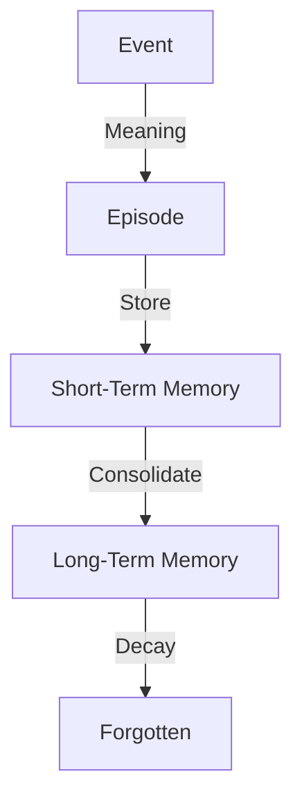

# 09_MEMORY.md — Память и Опыт

## Текущий статус
✅ **Реализован** (v1.0)
*   Файл: [`src/memory/memory.py`](../../src/memory/memory.py)
*   Интегрирован в [`src/state/self_state.py`](../../src/state/self_state.py)
*   Поддерживает хранение эпизодов с типом события, значимостью и временной меткой.
*   Ограничение размера памяти до 50 записей.

### Описание реализации
Memory как `list[MemoryEntry]` в SelfState, append после MeaningEngine если significance >0, clamp_size=50 (drop oldest).

#### Пример структуры MemoryEntry
```python
@dataclass
class MemoryEntry:
    event_type: str  # Тип события (например, 'decay', 'recovery')
    meaning_significance: float  # Значимость события для памяти
    timestamp: datetime  # Время создания записи
```

#### Принципы
- Только значимый опыт: Записи добавляются только если significance > 0 после обработки MeaningEngine.
- Нет активации/влияния на state: Память хранит опыт, но не влияет на текущее состояние или поведение.

## Концепция
Память в Life — это не база данных фактов, а **след прожитого опыта**.
Life помнит не всё, а только то, что оставило эмоциональный (значимый) отпечаток.

## Принципы работы

1.  **Эпизодичность:** Память состоит из эпизодов (Events + Meaning).
2.  **Ассоциативность:** Доступ к памяти происходит не по ID, а по сходству контекста (Activation).
3.  **Забывание:** Память, которая не активируется, со временем стирается или архивируется.
4.  **Искажение:** При каждом воспоминании (Recall) память может немного изменяться.

## Структура памяти



### Episode (Эпизод)
Единица хранения. Содержит:
*   Слепок события (Event).
*   Субъективное значение (Meaning).
*   Контекст состояния (Self-State snapshot).

## Текущая реализация

### MemoryEntry
Класс [`MemoryEntry`](../../src/memory/memory.py) представляет единицу памяти:
*   `event_type: str` — тип события (например, 'decay', 'recovery').
*   `meaning_significance: float` — значимость события для памяти.
*   `timestamp: datetime` — время создания записи.

### Memory
Класс [`Memory`](../../src/memory/memory.py) наследует от `list` и управляет коллекцией записей:
*   `append(item)` — добавляет запись и автоматически ограничивает размер.
*   `clamp_size()` — поддерживает максимум 50 записей, удаляя самые старые при превышении.

### Интеграция в SelfState
Память интегрирована в [`SelfState`](../../src/state/self_state.py) как поле `memory: list[MemoryEntry]`, что позволяет сохранять и загружать состояние памяти вместе с остальным состоянием жизни.

## Ограничения (Limits)

1.  **Не всеведущность:** Life не помнит всего.
2.  **Не точность:** Память не является точной записью (как лог). Это реконструкция.
3.  **Не база знаний:** Память хранит *личный опыт*, а не факты о мире (Википедию).

## Пример использования

```python
from src.memory.memory import MemoryEntry, Memory
from datetime import datetime

# Создание записи памяти
entry = MemoryEntry(
    event_type="decay",
    meaning_significance=0.8,
    timestamp=datetime.now()
)

# Создание объекта памяти
memory = Memory()
memory.append(entry)

# Память автоматически ограничивает размер до 50 записей
print(f"Размер памяти: {len(memory)}")
```

## Связь с другими модулями

*   **Meaning Engine:** Создает материал для памяти (см. [`src/meaning/`](../../src/meaning/)).
*   **Activation:** Механизм извлечения памяти (см. [10_ACTIVATION.md](10_ACTIVATION.md)).